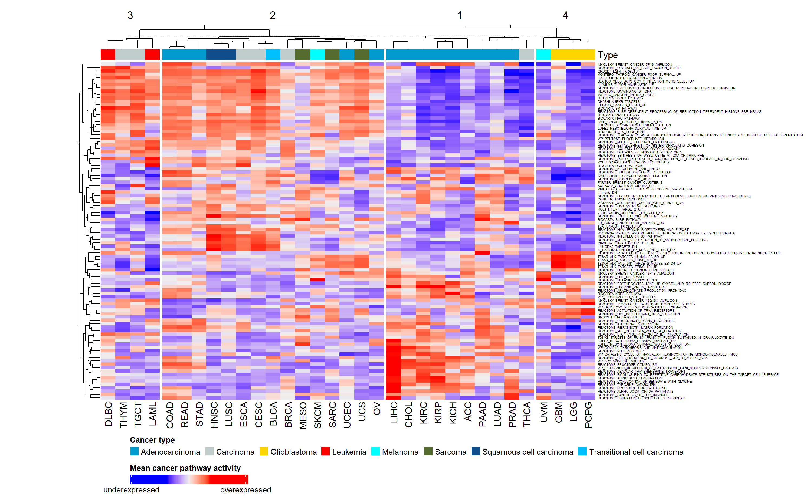
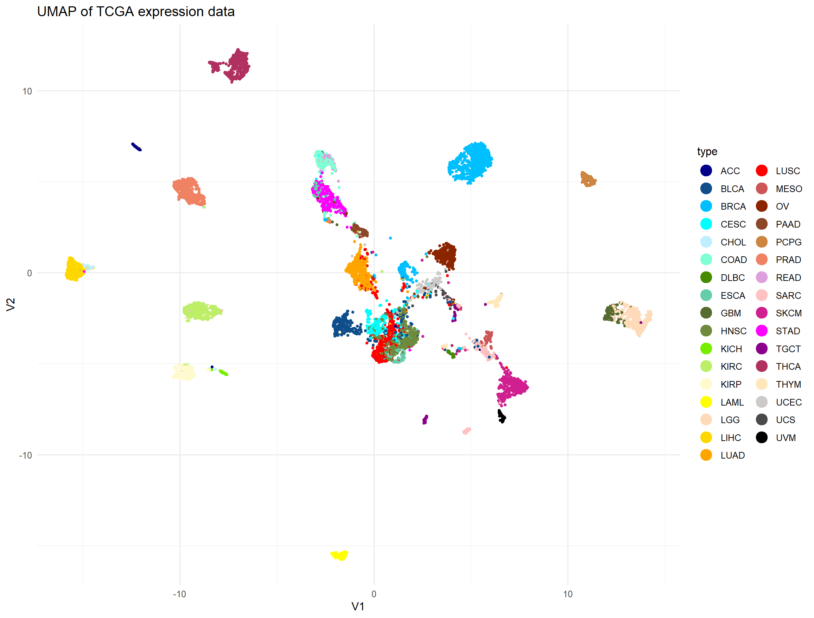

<!-- Based on Nicolas Peschkes LaTeX Template for MoBis, if you want further information on the packages just check it here: https://gitlab.com/npeschke/LaTeX-Template-IPMB -->

<!-- Title page -->

```{=tex}
\begin{titlepage}
\centering
    {\Large Ruprecht-Karls-University Heidelberg\\
        Faculty for Life Sciences\\
        Molecular Biotechnology\\}

    {\vspace{\stretch{2}}}
    {\usekomafont{title}

        {\Huge Identification of thyroid cancer subtypes driving carcinogenesis through different ways of proliferative signaling }

    }

    \vspace{\stretch{2}}
    {\Large Data Science Project SoSe 2022}

    \vspace{\stretch{2}}

    {\small
        \begin{tabular}{rl}
            Authors & Anna Lange, David Matuschek, Jakob Then, Maren Schneider\\
            Date & 20.07.2022\\
        \end{tabular}
    }

    \vspace{\stretch{1}}

\end{titlepage}
```
<!-- Abstract -->

\addchap{Abstract}
In recent years bioinformatic methods became a tool of utmost importance in medical research. To detect specific gene and pathway patterns in different cancer types or histological types, a pan-cancer analysis is done. Furthermore, a focused analysis is done to specify different subcategories within a certain cancer type and to identify targets for therapy. As main methods in identifying up- or down-regulated pathways, Gene Set Enrichment Analysis (GSEA) and Gene Set Variation Analysis (GSVA) are used. GSVA of The Cancer
Genome Atlas (TCGA) expression data, containing 33 different tumor types, reveals four clusters of cancer types, which are defined by different histological types like glioblastoma and adenocarcinoma. Thus, the histological types seem to correlate with a specific set of pathways that are especially enriched in certain types. Furthermore, GSVA results of Thyroid cancer expression data show that thyroid carcinogenesis is associated with the up-regulation of proliferation signaling pathways like the hedgehog pathway, alpha6beta4 integrin signaling pathway, and associated pathways such as interleukin 36 signaling. Also, the down-regulation of a pathway that is associated with an increased MAP-kinase activity goes along with carcinogenesis. Based on those proliferation signaling pathways, three subclusters form inside the thyroid carcinoma (THCA) patients from the pan-cancer data. One THCA subcluster that could be linked to the follicular histological subtype is defined by increased mTOR and MAPK activity while having low alpha6beta4 activity. In contrast, another THCA subcluster is defined by a low mTOR and MAPK activity, but a high alpha6beta4 activity. The third THCA subtype is linked to the enhanced activity of both of these proliferation signaling pathways. These results promise more success in THCA treatment, as a more precise diagnosis of the distinct THCA subtypes, and with this a more targeted therapy is possible.
To improve the understanding of THCA, and thereby hopefully improve patients' prognosis, this project focuses on finding genes that have a significantly different expression in THCA compared to other cancers and especially to normal tissue.

\addchap{Abbreviations}
BRCA – Breast invasive carcinoma  
EGFR – Endothelial growth factor receptor  
ERBB2 – Erb-b2 receptor tyrosine kinase 2  
EWSR1/FLI1 – Ewing sarcoma breakpoint region 1 / Friend leukemia integration 1  
FTC – Follicular thyroid cancer  
GSEA – Gene Set Enrichment Analysis  
GSVA – Gene Set Variation Analysis  
IL-36 – Interleukin 36  
JAK/STAT – Januskinase / Signal Transducers and Activators of Transcription  
KICH – Kidney renal papillary cell carcinoma  
KIRC – Kidney renal clear cell carcinoma   
LIHC – Liver hepatocellular carcinoma   
Log2FC – Log2 fold change   
LUAD – Lung adenocarcinoma   
MAPK – Mitogen-activated protein kinase   
MSE – Mean squared error  
MST1 – Makrophage stimulating protein 1  
mTOR – Mammalian target of rapamycin   
NF-kB – Nuclear factor kappa-light-chain-enhancer of activated B-cells  
PCA – Principal component analysis   
PI3K – Phosphoinositid-3-kinase   
PRAD – Prostate adenocarcinoma   
PTC – Papillary thyroid cancer   
RAS – Rat sarcoma   
TCGA – The Cancer Genome Atlas  
TCV – Tall cell variant  
THCA – Thyroid carcinoma  
UMAP – Uniform manifold approximation and projection  
UTC – Undifferentiated thyroid cancer  
UVM – Uveal melanoma  


\tableofcontents

# Introduction

## Biological background
In 2019 230,000 cancer deaths were documented in
Germany\footnote{ https://www.krebsinformationsdienst.de/tumorarten/grundlagen/krebsstatistiken.php}.
To detect and fight these tumors, the development of new treatment and
detection methods is essential. A crucial step in this direction was the
characterization of the Hallmarks of Cancer - properties present in
every tumor. Among others, those are: resisting cell death, inducing
angiogenesis, enabling replicative immortality, activating invasion, and
evading growth suppressors [@cancer_hallmarks].

However, the different histological types of tumors are equally
important when characterizing cancers. Carcinoma, which can be further
subcategorized into adenocarcinoma, squamous cell carcinoma,
and transitional cell carcinoma, all derive from epithelial cells. Melanomas are skin tumors, sarcoma derive from mesenchymal tissue, glioblastoma from cells in the central nervous system and leukemia affects blood cells
[@cell].

Here we focus on Thyroid carcinoma (THCA) as its incidence increased
dramatically over the past few years [@THCA]. It arises in the thyroid
gland whose main function is synthesizing hormones and regulating body
temperate and metabolism [@THgland1]. THCA can occur in two different
types, differentiated and undifferentiated thyroid cancer. Those two
types again have histological subtypes. Papillary thyroid cancer (PTC),
the most common THCA, follicular thyroid cancer (FTC), and a tall cell
variant (TCV) are subtypes of differentiated thyroid cancer (DTC).
Medullary and anaplastic thyroid cancer are subtypes of undifferentiated
thyroid cancer (UTC). The prevalence of DTCs is higher than that of
UTCs [@THCA2]. Among all THCAs DTCs, PTCs have the best clinical
prognosis [@PCA1], while TCV cancers have the worst clinical outcome
[@PCA_aggressive]. Therefore, the characterization of different or
distinct expression patterns for each histological subtype would be
important for more specific therapy options. Even though all thyroid
cancers are treated with thyroidectomy and radioactive iodine, the
additional therapy differs for each histological type [@PCA3]. For
example, only some THCAs subtypes experience integrin alpha6beta4 driven
carcinogenesis which might provide a viable target for therapy. Integrins
are cellular adhesion molecules, that bind to laminin in the
extracellular matrix [@integrin1]. Together with other proteins, they
form hemidesmosomes. Thereby, integrins are essential for the integrity
of tissues. An important step in the development of malignant tumors
is the invasion of healthy tissue. Thus, the detachment of the
extracellular matrix from the surrounding cells is essential and
alterations of integrin are very common in cancer cells [@integrin2].

## Computational tools
## Computational tools

To analyze how the activity of a gene set differs between two sets of
gene expression data, a Gene Set Enrichment Analysis (GSEA) is
performed. For this, the genes in the expression data have to be ranked
decreasingly by a certain metric. Such metrics can include the
associated p-values for each gene or the log2 fold change between the
sample expression data and a reference set. After ranking, a cumulative
sum of all expression values in the ranked sample is computed. If a gene
is present in the gene set to be analyzed the expression value of that
gene is added to the running sum. However, if the current gene does not
lie in the gene set the value is subtracted. The extremum of this
running sum is termed the enrichment score of the gene set. It is
positive if the gene set is overexpressed in the sample compared to the
reference data and negative vice versa [@GSEA].

The Gene Set Variation Analysis (GSVA) is performed with the same
intention as the GSEA - to analyze the gene set activities in gene
expression data. However, no reference data is required to successfully
perform GSVA. There are various approaches to GSVA, one of them is
performed by [@GSVA] by following five steps. First, the cumulative
density distribution of a gene over all samples is estimated. Then the
expression statistic of a gene in a sample based on the cumulative
density distribution is calculated to bring all of the expression values
to the same level. The third step is to rank the genes based on the
expression statistic and to normalize the ranks with z-transformation.
Lastly, the enrichment score is computed based on the obtained ranked
list by calculating the Kolmogorov-Smirnov-like rank statistic for each
gene set [@GSVA].

The Uniform manifold approximation and projection for dimension
reduction (UMAP) is a method to reduce the dimension of a
multidimensional data set. Compared to PCA, UMAP preserves the global
structure of the data better and is much faster than other comparable
techniques like t-SNE [@tSNE]. The algorithm starts by setting up a
high-dimensional graph representation of the data. From each data point,
a radius is extended and when two radii come into contact the points are
connected in the graph. The radius is chosen individually for each point
based on the distance to the nearest neighbor. The algorithm goes on
until k points are connected or n iterations are reached. The resulting
clustered high-dimensional graph is then optimized for visualization
in low dimensions. A disadvantage of UMAP is that although the overall
structure is conserved, the distances between the individual points are
not proportional to the real distance in the data set. This arises from
the non-linear dimensional reduction [@UMAP].

The Jaccard index is the intersection, divided by the union of two sets.
Therefore, it can be used to identify the similarity of the sets.

For data regression, a neuronal network can be used. In general, a deep
learning network consists of an input layer, multiple hidden layers, and
an output layer consisting of various neurons [@neuronal]. The input
layer contains as many neurons as features are given for each sample.
The number of neurons in each hidden layer and the number of hidden
layers vary and must be tested to give the best results. The activation of
each neuron can be described as a linear composition of all the inputs
$x_i$ from the previous layer associated with a weight $w_i$ and a
bias:$$
Activation = \sum_{i=1} ^{n} w_i x_i + bias
$$To obtain neuron activations in the range of 0 and 1, a
min/max-scaling is performed on the input data. The "learning effect" of
the network is achieved by optimizing the randomly chosen weights and
biases via gradient descent. To do so, for each training iteration the
error of the network is computed by a cost function. Next, the cost
function value must be reduced. Therefore, its gradient is computed, and
all weights and biases are adjusted accordingly in a process called
backpropagation. In resilient backpropagation, only the sign of the
gradient is used, to avoid harmful effects of its magnitude. For the
next samples, those steps are repeated to reach the minimum of the cost
function. A drawback of this method is that gradient descent only
identifies local minima of the cost function. To find a global minimum
the training has to be repeated with various initial weights and biases.
After such a minimum is identified to network performs optimally for the
data set.

## Goals for the analysis
Using pan-cancer expression data, we identify clusters between cancer
types regarding their expression profiles as well as the hallmark and
metabolic pathway activities. Then, our focus shifts to THCA, where we
discover subclusters in gene expression linking them to histological
types. Additionally, we analyze pathways that alter significantly
between THCA and homeostatic thyroid tissue and predict their activities
with linear and neuronal network regression.

# Materials and Methods

## Given data
Four data sets were provided for this project. For pan-cancer analysis, a
gene expression data frame with normalized and log2 (tpm) transformed
bulk RNA-seq expression data for 60,489 genes in 9741 patients with 33
different forms of cancer were used. The data was derived from The Cancer
Genome Atlas (TCGA). Complementing the TCGA expression data is an
annotation data frame with 37 clinical annotations for all patients.

For the focused analysis, a list containing data frames with tumor and
homeostatic tissue expression data and corresponding annotations was provided
for five tumor types (BRCA, KIRC, LUAD, PRAD, THCA). For our focused
analysis, only the THCA data were used. The THCA list consists of three
data frames: The first two contain normalized, and log2 transformed bulk
RNA-seq expression data for 19,624 genes in 59 THCA patients for
carcinogenic and homeostatic tissue. The third data frame complements
the data with the respective clinical annotations.

The last object contains 46 pathways associated with the hallmarks of
cancer in the form of a list of vectors containing gene identifiers.

To perform enrichment analysis, 6366 canonical pathways were
selected from the Molecular Signatures Database (MSigDB) [@msigdb] with
the `msigdbr::msigdbr()` function. As not to introduce a bias during
enrichment analysis, the similarity of MSigDB pathways among themselves
as well as with the hallmark pathways was computed with the Jaccard
index. The pathways with a Jaccard index greater than a set threshold were
discarded.

## Preprocessing of expression data
All expression data were checked for missing values with the `na.omit()`
function. Subsequently, low variance filtering was performed for TCGA
and THCA tumor expression data. The variances of expression were
computed for every gene across all samples and then, genes with
variances below a threshold of 0.1 were discarded to reduce
dimensionality.

Next, biotype filtering was performed for pan-cancer and THCA expression
data to reduce dimensionality further. Only genes sharing biotypes with
the hallmark pathways were kept for the following analysis. The
biotypes of the genes were retrieved using the `biomart::getBM()`
function from the biomaRt package [@biomart]. To allow for an
appropriate comparison within all pathways, only MSigDB pathways in
which over 99% of their respective genes were present in the filtered
expression data were selected as final pathways.

## Methods for descriptive analysis
In a mean-variance plot, the variance is plotted over the mean 
expression value of a single gene across all patients. Thus, the
variance and mean were calculated for each gene in the THCA expression
data. The final plot was created with the package ggplot2 [[@ggplot2].

A volcano plot is used to identify genes displaying significantly
differentially expressed genes in cancerous versus homeostatic tissues. First, the
log2 fold change (Log2FC) is calculated for each gene across all samples
in the THCA expression data in the following way: $$
log2FC = mean(normal tissue) - mean(tumor tissue)
$$ Next, a two-sided Wilcoxon rank sum test was performed with the
`wilcox.test()` function to determine the significance of a difference
in expression. To avoid the accumulation of type one errors, a
Bonferroni correction was performed. $n$ is the number of genes in the
cleaned data set for focused analysis: $$
\alpha = \frac{0.025}{n}
$$ In the volcano plot the -log10 of the calculated p-values are plotted
against the Log2FC. Genes with a lower p-value than the corrected
significance level $\alpha$ are significantly differentially expressed. If
the Log2FC is additionally positive, the genes are significantly
overexpressed in tumor tissue. If the Log2FC is negative, the genes are
significantly underexpressed in tumor tissue.

## Gene Set Scoring and Dimension Reduction 
The GSEA was used to identify enriched pathways in THCA tumor tissue.
Here, GSEA was performed with the package "fgsea" [@fgsea]. First, the
expression values were ranked in decreasing order by Log2FC for every
patient. Log2FC was chosen as the ranking metric as it is easy to
compute and shows a high sensitivity [@rank]. Secondly, using the
ranked Log2FC vectors, the enrichment score of each pathway was
calculated for each patient with the `fgseamultilevel()` function.

As no normal tissue reference data was provided for the TCGA expression
data, pathway activities were computed via GSVA. The analysis was
performed with the `gsva()` function from the "GSVA" package [@gsva]. To
give a general overview of the differences in expression of THCA and
homeostatic thyroid tissue GSVA, the THCA expression data were also
analyzed by GSVA. To do so, tumor and normal expression data were
combined into a singular data frame of which enrichment scores were
computed with `gsva()`. Then, the GSVA data was split again and the
log2FC between the two matrices was computed and taken as pathway
activity.

PCA was performed to provide a set of orthogonal data for the subsequent
UMAP. For the pan-cancer GSVA pathway activity data the `prcomp()`
function was used. To verify the results, PCA was performed on TCGA
expression data, as well. In this case `Seurat::RunPCA()` from the
Seurat package was used to minimize computation time [@seurat].

UMAP analysis was conducted on all principle components from previous PCA to
identify and visualize clusters in TCGA GSVA and expression data. This
was achieved with the `umap()` function from the package "umap" [@umap]
running on all PCs from TCGA GSVA expression data.

## Regression analysis
For THCA pathway activity regression analysis a highly variant and
significantly altered pathway was selected. To prepare the data
appropriately the THCA GSEA data set was divided into a training and
test data set containing 44 and 15 samples respectively. A linear
regression analysis was performed on the training data with the `glm()`
function. To do so, the correlation of all pathways was computed and
pathways with high correlations are omitted. Subsequently, 10% of
the most variant pathways are selected as variables for the regression
model. A second model was introduced by selecting only those pathways
contributing significantly to the model.

A neural network was implemented to predict the pathway activity using
the `neuralnet()` function from the "neuralnet" package [@neuralnet].
For identification of the best initial conditions, 25 different networks
are generated, each with two hidden layers and different combinations of
neurons per layer. For each combination, the network was trained on the
min-max-scaled training data, and the best network was determined by the
lowest mean squared error (MSE) in the test data.

## Environment
The R version 4.0.1 was used, the table of used packages is attached in
the appendix (see table \@ref(tab:packagesused)).

# Results

## Preprocessing

**Dimension reduction through low-variance and biotype filtering**
All the TCGA and THCA expression data were checked for NAs, which were
subsequently deleted. Genes with a variance lower than 0.1 were removed
to reduce dimensionality, as they contribute very little to the overall
variance of the data set and are most likely house-keeping genes (xxx
Quelle oder löschen). The low-variance filtering of the THCA data set
was done in a similar way. Genes with a lower variance than 0.06 were
deleted in the tumor tissue and the normal tissue data. To reduce
dimensionality further, the biotype of the hallmark pathway genes was
determined, which was almost exclusively protein coding. To match this,
only protein coding pathways were kept in all expression data sets for
further analysis. Doing so, the number of genes in the pan-caner data
set was reduced from 60,000 to approximately 19,000 genes and from
approximately 20,000 genes to 15,000 genes in the THCA data.

**MSigDB pathway filtering**
The pathways from the MSigDB database were first aligned with the genes
in our expression data. Only pathways with a coverage of over 99% were
kept. To test for similarity in the selected metabolic pathways compared
to the hallmark pathways and the metabolic pathways themselves, the
Jaccard index between all pathways was calculated. Pathways with a high
Jaccard index were identified and subsequently deleted. Heatmaps,
displaying the jaccard index of cleaned and uncleaned data can be seen
in the appendix \@ref(fig:Jaccarddirtea) \@ref(fig:Jaccardcleaned). The
number of MSigDB pathways could thus be reduced from 6366 to 657.

## Descriptive analysis

**Mean-variance plot of TCGA expression data shows highly variant genes**
To determine the genes from the TCGA expression data with a high
variance, the variance was plotted over the mean (Figure
\@ref(fig:showmeanvariance)). Additionally those genes with a variance
higher than 33 were labeled with their EnsembleID. The distribution of
genes in this plot shows that the highly variant genes are around a log2
mean expression level of 0. The plot also shows, that very few genes are
at a low mean expression level or at a very high mean expression level.
Most genes are expressed across all patients at a log2 mean expression
level of approximately 0. With this plot we were able to determine which
genes differ significantly in their expression level across all cancer
patients.

**Significantly up- and down regulated genes in THCA obtained from volcano plots**
To determine up- or down-regulated genes in THCA corresponding p-Values
were computed with a Wilcoxon rank sum test. (Figure
\@ref(fig:showvolcanoplot)). The significance level was adjusted to
1.755e-06 with a Bonferroni adjustment.

```{r showvolcanoplot, echo=FALSE, eval=TRUE, out.width='100%', fig.align='center', fig.cap="Volcano plot of THCA expression data. Downregulated genes are colored red, upregulated genes blue. Not significantly altered genes are colored green. Most significantly altered genes are labelled with their gene symbol"}

knitr::include_graphics("figures/Volcanoplot.png")

```

## Pan cancer analysis

**GSVA of TCGA expression data reveals four clusters of cancer types.**
A pathway activity matrix was computed as described in section
(methods). The obtained pathway activity matrix was visualised in a
heatmap. \@ref(fig:meanexp) and supplementary material \@ref(fig:exp)

The tumor types were clustered hierachically based on their mean pathway
activity and formed four clusters correlating with their histological
type. The first cluster contains mainly adenocarcinamas, while the
second one contains predominately glioblastomas. Leukemias are only
found in the third cluster and the last cluster is enriched with
sarcomas and carcinomas. Melanomas appear in the second and fourth
cluster. Furthermore, three observations were made regarding specific
information about pathway activity.

Pathways, which are important for nucleus import and export like the Ran
shuttle pathway, as well as pathways for transcription regulaturs in
embryonic stem cells are down-regulated in glioblastoma and
adenocarcinoma. However, these pathways are up-regulated in all other
histological types \@ref(fig:meanexp).

Another observation is the clustering of glioblastoma. Pathways
initiating neurogenesis and pathways linked to differentiation of the
neural crest are up-regulated only in glioblastoma [@result6]. Two other
pathways, that are up-regulated in glioblastoma cells are pathways
linked to the activity of tyrosine kinases. The up-regulation of
tyrosine kinases promote cell growth and proliferation [@cell]. Taken
together these two observations are in line with the expected high
proliferation rate commonly found in glioblastoma.

The third cluster is mainly related to adenocarcinomas, more
specifically liver hepatocellular carcinoma (LIHC), kidney renal
papillary cell carcinoma (KICH) and kidney renal clear cell carcinoma
(KIRC). The up-regulated pathways are involved in metabolism of
carbohydrates, synthesis of lipids, synthesis of amino acids and
detoxification.

```{r meanexp, echo=FALSE, eval=TRUE, out.width='87%', fig.align='center', fig.cap="Mean pathway activity of the 100 most variant pathways for each tumor type. Column clusters were obtained by complete hierachical clustering and subsequently split into four groups. Pathway activities were computed via GSVA of pan-cancer expression data. For all pathway activities see figure (XXX in the apendix)."}


```


**Dimension reduction of GSVA pan-cancer data reveals clusters in
pathway activity.**
PCA was performed on GSVA pan-cancer for UMAP analysis. No apparent
clustering was observed only in PCA data (Supplementary material
@ref(fig:PCAcancerform) and \@ref(fig:PCAcancertype) ). Subsequent UMAP
analysis, showed clear clusters for most cancer types.
(\@ref(fig:UMAPPanType) and Supplementary material
\@ref(fig:UMAPPanForm)). This complements the results obtained from our
heatmap and reassures, that the tumor types have characteristic pathway
activities. However, some cancers cluster better with their histological
type rather than tumor type. This was observed mainly for carcinomas
like squamous cell carcinoma and transitional cell carcinoma, as well as
sarcoma, lung adenocarcinoma and ovarian cancer. These are the same
histological types that proofed difficult to cluster in the mean GSVA of
TCGA expression. The UMAP confirmed the assumption, that the
histological type of a tumor has a major impact on the patients gene
expression profile.

```{r UMAPPanType, echo=FALSE, eval=TRUE, out.width='80%', fig.align='center', fig.cap="UMAP of TCGA pathway activity, colored by tumor type"}


```
The same analysis was performed for gene expression activity instead of
pathway activity to check for reliability of the results. Similar
clusters were observed, which confirms our results. See
\@ref(fig:UMAPGenform), \@ref(fig:UMAPGen) in the appendix.

## Focused analysis

**GSVA on THCA expression data reveals pathways driving thyroid
carcinogenesis.**
To grasp a general overview of the differences in pathway activity
between THCA and homeostatic thyroid tissue, GSVA was performed for the
THCA expression data. Based on the GSVA results, differantially
different active pathways were identified using the workflow described
for volcano plots \@ref(fig:THCAvolcano). Most prominently among them
were pathways linked to proliferative signaling such as upregulation of
p53 inhibitory proteins and hedgehog pathway activating Gli proteins.
Further, the alpha6beta4 integrin signaling pathway and associated
pathways such as IL-36 signaling and Typ I hemidesmosome synthesis were
significantly enhanced in THCA. Further, signaling through the
EWSR1/FLI1-fusion protein was significantly upregulated in THCA. Lastly,
THCAs showed downregulation of non-histone protein methylation.

```{r THCAvolcano, echo=FALSE, eval=TRUE, out.width='80%', fig.align='center', fig.cap="Volcano plot of THCA pathway activity. Downregulated pathways are colored red, upregulated pathways blue. Not significantly altered pathways are colored green. Most significantly altered pathways are labelled with their name."}


```

**Pan-cancer data GSVA reveals three subtypes of THCA altering in
proliferative signaling.**

To investigate potential subtypes of THCA, the respective samples were
taken from the pan-cancer GSVA data. The optimal number of clusters was
determined by an elbow plot and subsequent K-means clustering revealed a
total of three subtypes in THCA \@ref(fig:THCAhm). This is consistent
with the three clusters of THCA observed in the full pan-cancer GSVA
data. The follicular histological type was enriched in cluster B, with
no tall cell types present in this cluster. Judging from histological
type alone no difference in clusters A and C was observed. Most
significant changes in pathway activity were observed in pathways
concerning proliferative signaling. In comparison with all other tumor
types, cluster A displayed high activity of RAS, JAK/STAT and
EWSR1/FL1-fusion mediated signaling as well as elevated signatures
associated with carcinogenesis driven by alpha6beta4 activity. In
contrast, these pathways were downregulated in cluster B, with it
showing elevated activity in mTOR, MAPK, PI3K, and EGFR signaling
cascades. Cluster C was found to upregulate all the aforementioned forms
of proliferative signaling. All clusters showed a homogenous
upregulation of hedgehog, ERBB2, and MST1 pathway activity. Regarding
immune response, cluster C showed no significant alterations in the
respective hallmark pathways, however, these pathways were downregulated
in both clusters A and B. With this data, we can identify two seemingly
different forms of proliferative signaling driving carcinogenesis in
THCA. These forms can either occur separately as in the case of clusters
A and B or combined as for cluster C.

```{r THCAhm, echo=FALSE, eval=TRUE, out.width='100%', fig.align='center', fig.cap="Pathway activity of the 50 most variant, hallmark, and 20 most significantly altered pathways for each patient. Column clusters were obtained by k-means clustering with k=3. Pathway activities were computed via GSVA of pan-cancer expression data. For all pathway activities see figure (XXX in the apendix)."}


```

**THCA subtypes do not differ in their metabolism.**
To investigate how the identified subtypes compare to homeostatic
thyroid tissue, GSEA was performed for the THCA data. Consistent with
the pan-cancer analysis of THCA data, k-means clustering obtained three
different clusters in pathway activity -- verified as the optimal number
of clusters via an elbow plot. All clusters showed a similar change in
metabolism \@ref(fig:THCAhmGSEA). Catabolic pathways are downregulated
whereas anabolic pathways e.g., fatty acid synthesis show increased
activity in comparison with normal tissue. Further, the results seem
consistent with the proliferative signaling activities found previously.
Alpha6beta4, RAS, JAK/STAT, and EWSR1/FL1-fusion mediated signaling is
upregulated in clusters one and three with low expression in cluster
two. However, the upregulation of mTOR, MAPK, PI3K, and EGFR signaling
in clusters two and three was observed only in some samples. Regarding,
immune response the expression profiles are again consistent with
differences observed in the GSVA pan-cancer data: Both clusters one and
two show a lower immune response compared to cluster three. From these
GSEA results, we can conclude that the three subtypes of THCA differ in
carcinogenesis and associated immune response but share a similar
metabolism consistent with the Warburg effect.

## Regression analysis of THCA pathway activity
To select a suitable pathway for regression analysis, the top 20%
pathways regarding their variance in activity were chosen, as for the
regression model to predict. Pathways with little variance were found to
be better predicted by a null model (Fig xxx supplementary material). To
factor in biological significance, the intersect of the 25 most
significantly altered pathways from GSVA with the high variance pathways
was computed. This resulted in three significantly altered and highly
variant pathways among which the REACTOME_INTERLEUKIN_36_PATHWAY (IL-36 pathway) gene
set was selected. This gene set ranks 8th among the highest upregulated
pathways with an associated p-value of 8.411155e-15. Interleukin 36
signaling is connected to both MAPK activity and through the activation
of NF-kB and also the expression of integrin alpha6beta4.[@result4;
@result7; @msigdb].

Regression of the IL-36 pathway gene
set showed mixed results. After multiple testing an architecture with
two hidden layers with 10 and 20 neurons respectively at `set.seed(50)`
was shown to produce the best results for neuronal network regression.
Among the tested models, the neuronal network performed best on the test
data with a mean squared error (MSE) of 0.06. However, the linear
regression model failed to predict the data accurately (MSE = 0.62).
Repeated linear regression with just pathways contributing significantly
to the result the performance was enhanced (MSE = 0.40), however,
remained worse than a null model (MSE = +0.22). \@ref(fig:reg)
Comparison of the MSE on test an training data reveals, that linear
model is highly overfitted ($\Delta$MSE = +0.55) with the linear model
with significant pathways fitting slightly better ($\Delta$MSE = +0.23)
to the data. Our null model displayed an good, yet slightly underfitted
performance with $\Delta$MSE = -0.08. With a $\Delta$MSE = +0.009 the
neuronal network shows a perfect fit.

A comparison of the four regression models via the F-test function
`var.test()` showed a significant improvement of the neuronal network
compared to all other models. All other models showed no significant
differences in their performance \@ref(fig:reg) compared to each other.
From this data, we can conclude that a neuronal network is the best
choice for most accurately predicting IL-36 pathway activity in our test
data.


# Discussion
Our pan-cancer analysis showed four clusters in pathway activity data.
We were able to find specific pathways, which were enriched only in
certain histological types like glioblastomas and adenocarcinomas. The
focused analysis of THCA expression data revealed pathways drivin
carcinogenesis in Thyroid cancer. Furthermore we were able to
subcatergorize THCA into three subtypes based on proliferative
signalling pathway activity. As shown by the data signaling through
alpha6beta4, RAS, JAK/STAT, and EWSR1/FLI1-fusion mediated pathways are
linked to the non-follicular histological subtype of THCA. Our findings
from pan-cancer expression data show promising results. Via GSVA
analysis we identified four clusters in the cancer types correlating
strongly to the associated histological type. Glioblastoma seem to take
a special role as they are predominantly characterized by the high
activity of neural crest differentiation pathways and receptor tyrosine
kinases. This is in line with previous studies showing that
glioblastomas derive from neural crest cells [@neuralcrest].

This was also found for some melanoma like UVM, which explains the
observed clustering of UVM with other glioblastoma. Also, the high
receptor tyrosine kinase activity has been linked to the formation of
UVM and glioblastoma and suggested as a possible target for therapy
[@dis1; @dis2].

Further, especially liver and kidney adenocarcinoma seemed to form a
strong subcluster within the other adenocarcinoma. They are
characterized by exceptionally high activity of metabolic pathways such
as carbohydrate metabolism, lipid, and amino acid synthesis. Again, this
change in metabolism was previously found in hepatocellular carcinoma
[@dis3]. An up-regulation of these metabolic pathways may lead to cell
growth and proliferation, due to higher metabolic activity, providing
more biomass and energy.

The most significant classification we found was the clustering of tumor
types by their differentiation stage. Poorly differentiated tumors like
leukemia and squamous cell carcinoma show an upregulation of pathways
associated with embryonic stem cell-like expression signatures. In
contrast highly differentiated tumors like most adenocarcinoma as well
as most glioblastoma show a low activation of these gene sets. Such a
clustering by differentiation stage was previously described by
Ben-Porath et al.. However, these findings cannot be verified directly
as provided annotation data did not contain information regarding the
differentiation stage [@dis4].

From our GSEA and pan-cancer GSVA results, we identify two separate ways
of carcinogenesis in THCA. The follicular subtype upregulates
proliferative signaling through mTOR/PI3K and MAPK signaling pathways, which goes along with previous studies [@dis5].

A second way of carcinogenesis by signaling through alpha6beta4, RAS,
JAK/STAT, and EWSR1/FLI1-fusion mediated pathways was observed in the
data. This way of carcinogenesis was linked to non-follicular types of
THCA [@result3; @dis6; @dis7].

The finding that the alpha6beta4 integrin signaling pathway and
associated pathways such as IL-36 signaling and Typ I hemidesmosome
synthesis were significantly enhanced in THCA is in line with previous
studies. Those studies link alpha6beta4 signaling to the development of
aggressive forms of thyroid cancer [@result4; @result3]. Also,
oncogenic signaling pathways commonly associated with different cancer
types were significantly upregulated in THCAs. Among them, we observed
ERBB2 and MST1 signaling commonly found in breast cancer. A role for
MSP/Ron in breast cancer has recently been elucidated, wherein this
pathway regulates tumor growth, angiogenesis and metastasis [@result2].

A main pathway up-regulated in THCA is signaling through
EWSR1/FLI1-fusion protein, while non-histone protein methylation is
down-regulated in THCA. This process was identified as an import
modulator of intracellular signaling by the MAPK, WNT, BMP, Hippo, and
JAK/STAT pathways and might play an important role as a driver of
carcinogenesis in THCA [@result1]. Together these findings give a
general overview of mechanisms driving carcinogenesis in THCA. However,
no information about possible THCA subtypes or differences in patway
activity between patients can be obtained from this data.

Pan-cancer GSVA shows three distinct clusters in the expression data,
upregulating either one or both ways of proliferative signaling. While
the follicular subtype seemed to strongly correlate with one cluster, a
similar process was not observed in tall-cell and classical phenotypes.
With more detailed annotation data it might be possible to link
anaplastic and papillary histological subtypes of THCA to the two yet
unassigned clusters.

Despite differences in proliferative signaling, all clusters share an
upregulated hedgehog signaling pathway which is consistent with the
literature [@dis8]. Also, metabolic changes in line with the Warburg
effect were observed in all clusters.

For regression analysis by linear regression and a neural network the
IL-36 pathway was chosen, since it is connected to both MAPK activity
and through the activation of NF-kB and also the expression of integrin
alpha6beta4. An effective regression might be crucial in finding
potentially druggable targets in combating THCA. Our data suggest that
our neuronal network is well suited to predict pathway activities from
GSEA data. The model shows an excellent fit to data and produces only
minor errors. However, both linear models struggle in predicting the
data accurately. This might be since GSEA pathway activity data usually
clusters into an up- and down-regulated group with no values in between.
Since the IL-36 pathway also shows this problem, the two clusters might
produce larger correlation values that might impact the accuracy of the
regression coefficients and the intercept. Secondly, the correlation of
the residuals with the test data values did not approach zero, thus, our
linearity assumption is not met. Therefore, it can be concluded that a
linear regression model is not well suited to predict the IL-36 pathway
activity accurately.

**Conclusion and Outlook**
Taken together our results are in line with current research and allow
for the following hypothesis: The expression profile of a given cancer
type depends highly on its differentiation stage and its histological
type but little on the actual tumor type itself. Understanding how these
changes in expression link to mutational signatures might help in
developing druggable targets for therapy.

Our findings suggest THCA can be devided into three subtypes based on which proliferative signaling pathway is active. These findings are in line with previous studies. 

Futher ways of analysis could be the prediction of the histological type
of THCA as well as the way of carcinogenesis with a neuronal network.
This might be possible with a larger training data set as well as more
detailed and specified annotations. Furthermore, it might be possible to
link whole genome sequencing and methylation data to pathway activity.
In that way, one could suggest a suitable targeted therapy option for a
THCA patient based only on sequencing data from a small biopsy sample.

# References

::: {#refs}
:::

# Appendix
