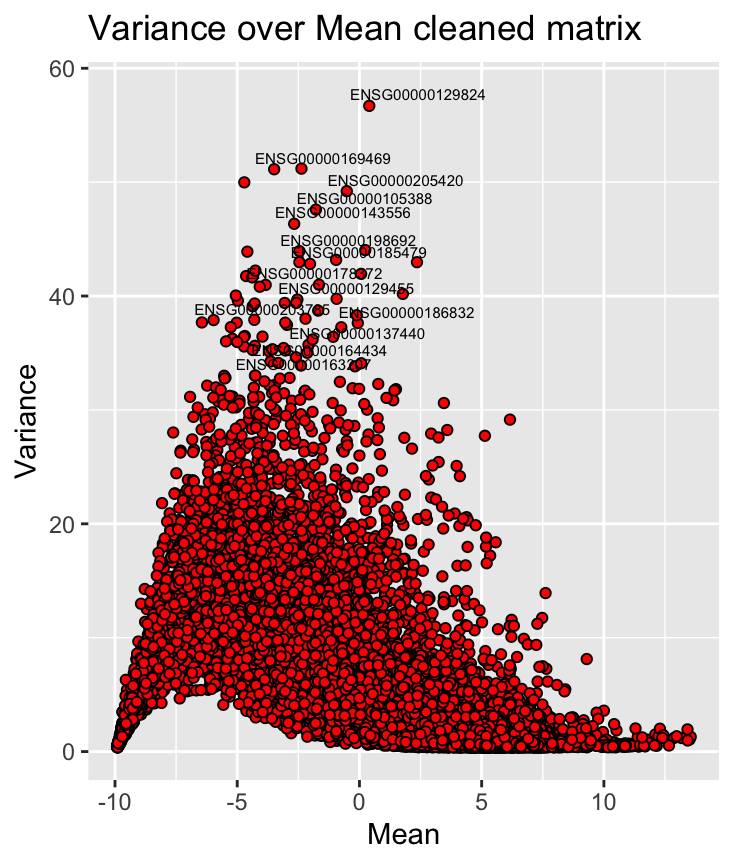

```{r setup, include=FALSE}
knitr::opts_chunk$set(echo = TRUE)
```

# Introduction

## Thyroid carcinoma (THCA)

THCA incidence increased dramatically over the past few years (<https://jamanetwork.com/data/journals/intemed/936342/m_ied170005f1.png>) REFERENCE, deswegen schauen wir uns die Gene, die THCA verursachen im unserer Analyse näher an. Allerdings sind nur 1% der deutschen Tumoren THCA.

Thyroid cancers werden in verschiedene Typen aufgeteilt, der häufigste Typ ist papillary thyroid cancer (PTC) with 80% of total Thyroid cancers. The most common mutation in PTC is the V600E-Mutation of the RAF-Kinase, what causes a constant activation and by intracellular signaling it promotes tumor cell growth and thereby growth of the tumor.

Normally the Thyroid gland controls the body temperature and the metabolism.

\

## Hallmarks of cancer

Warum analysieren wir das überhaupt, was ist der Vorteil von transcriptomic profiling methods

DAdurch kann der tumortyp identifiziert werden für geeignete behandlung weil geliches gewebe bedeutet nicht immer gleiche Bahndlung/gleiche Urasache

-   dadurch können risikofaktoren vorhergesagt werden

vllt wichtig weil todesraten generell hoch in Bevölkerung

-   riesige datenmenge kann nicht mehr einfach so analysiert werden

-   

Woher kommen die daten (RNA-seq, TGCA atlas consortium, pan cancer papers)

Epigeentic profiles??

Was ist unsere Fragestellung?? und warum ist genau die so interessant?? und wie haben wir das erreicht=

## Computational tools

GSE methods um gene zu analysieren die bei RNA- seq analyse´siert wurden (fangen an mit einer ranked gene list =>x single enrichment score für jedes Geneset (2 genesets werden verglichen also zb normales und tumorgewebe)

#### Gene Set Variation Analysis (GSVA)

Eine Form von Gene set ebrichment analysis

schätzt die veränderung Pathway aktivität eine Population, unsupervised = kleine Verönderung der ptahwayaktivität werden erkannt

Analyse muss für froße, heterogene populationen mit komplexen phänotypischen Merkmalen möglich sein

=> Lösung GSVA: nicht-parametrisch, unsupervised

1.  input: gene expression matrix mit rna seq counts in unserem Fall
2.  ERstellen der Gene expression level statistic von Gen i in einem sammple durch Berechnen der kumulativen Verteilungsfunktion von allen Genexpressionsdaten
3.  Ranke der gene expression statistics
4.  Kolmogorov-Smirnov-like rank statistic wird für jedes gene set berechnet

#### Gene Set Enrichment Analysis-

die GSEA wird mit dem glleichen Zielgenutzt wie die GSVA

#### UMAP

#### PCA

## 

# Material and Methods

## Our data sets (including our metabolic pathways)

For the analysis 4 data sets were provided.

1)  Gene expression data frame: The Gene expression data frame contains 60,000 genes and and their expression in 10,000 patients, and derived from The Cancer Genome Atlas (TCGA). The expression of those genes was obtained by RNA-seq HIER KOMMT NOCH DIE EINHEIT HIN
2)  Clinical annotations: The second data frame contains 37 clinical annotations like Tumor type, age, gender, etc. concerning the 10,000 patients fro the Gene expression data frame.
3)  Data for focused analysis: The third object contains 5 lists, one for each tumor type (BRCA, KIRC, LUAD, PRAD, THCA). For the focused analysis the THCA data was used. The list contains 3 data frames, each one with information about the same 60 patients. The first one with gene expression data from THCA tissue, the second one from normal tissue and the third one contains the clinical annotations like age and gender.
4)  Hallmark gene sets: A R object containing 46 pathways involved in phenotypes partly included in the hallmarks of cancer and the genes involved in those pathways.

SIND DIE DATEN NORMALISIERT ODER ALS COUNTS?

## Metabolic pathway selection

Furthermore 600 pathways were selected from the Molecular Signatur Database (MSigDB) (QUELLE)

um die mit den HAllmark pathwayszu vergleichen und weiter wichtige pathways für cancer zu identifizieren

dafür war es wichtig, dass die möglcihst viele gene aus den pathways in den hallmarks enthalten waren, um deren expression zu vergleichen

um die relevaten pathways herauszusuchen wurde die uberschenidung der gene ausgerechnet und in einem histogramm dargestellt, das in Figure \@ref(fig:showhistcanonical) dargestellt ist. Pathways mit einer Überschneidung von mindestens 99% wurden für die weitere Analyse verwendet.

```{r Selection of canonical pathways, echo=TRUE, eval=FALSE}
load('data/tcga_genes_cleaned.RData')
coverage = sapply(pathway_list, FUN = function(x){
              enthalten = x %in% tcga_genes_cleaned$tcga_geneids
              res = sum(enthalten)/length(enthalten)
              return(res)
            })
our_genesets = pathway_list[which(unname(coverage >= 0.99))]

```

```{r showhistcanonical, echo=FALSE, eval=TRUE, out.width = '100%', fig.align = "center", fig.cap="**Mean gene expression split by tumour type.** Log2-transformed gene expression values, given in transcripts per million (TPM), were averaged per tumour type and visualised in a violin plot."}

knitr::include_graphics("tcga_exp_biotypes.png")

```

Um dopplungen innerhalb der gewählten Pathways zu vermeiden wurden diese mithilfe vom Jaccard index auf Überschneidungen überprüft und als heatmap dargestellt. Es war zu sehen, dass sich einige pathways überschneiden. Um die Pathways mit den meisten Dopplungen zu entfernen, wurde die Summe der Jaccard-Indices der einzelnen pathways verglichen. Eine hohe SUmme bedeutet hier, dass es viele Dopplungen gibt und ist in der heatmap als weiß bis rotes Element dargestellt. Die Pathways, die im 1sigma Bereich liegen, wurden behalten, alle anderen entfernt. Der Erfolg des cleanings wurde mit einer Heatmap überprüft, da wenige Elemente eine andere Fabrbe als blau haben, wurde angenommen, dass das celaning erfolgreich war.

Um Dopplungen von Hallmark Pathways und den gewählten pathways zu vermeiden wurde auch zwischen diesen Pathways jeweils der Jaccard-index erstellt als Heatmap dargestellt. Auch hier wurden nur die Pathways behalten, deren Ähnlichkeit innerhalb des 1-Siga-Bereichs liegt. Das Ergebnis wurde wieder als Heatmap in Figure dargestellt. Es sind keine Dopplungen mehr vorhanden, es wurden etwa 600 Pathways erhlten, die für die weitere Analyse verwendet werden können.

## Preprocessing

### Deleting NAs

Deleting of NAs can be done with the R-function na.omit(x).

### Low-variance filtering

Low-variance filtering wird gemacht, damit Daten mit einer niedrigen Varianz aus dem Datensatz entfernt werden können. Zur BErechnung der Varianz wird die R-Funktion var(x) verwendet und gene, deren Varianz unter einem bestimmten Schwellenwert liegen werden entfernt.

Bei der focussed analysis wurden nur die Varianz der Expression im Tumorgewebe bestimmt und die Gene mit einer niedrigen Varianz im Tumorgewebe aus beiden Datensätzen zur focussed Analysis gelöscht.

### Biotype filtering

Beim biotype filtering wird der Biotype von jedem Gen bestimt (Proteincodiernd, RNA, ...) und mit den Biotypes von anderen Datensätze verglichen. Um eine möglichst geeigneten Vergleich zwischen der Expressionsdaten zu ermöglichen, werden nur die Biotypes behalten, die in allen datensätzen zum Großteil vorhnanden sind. Der Biotype kann mit der R-Funktion checkbiotypes(x) asu dem Package biomaRt bestimmt werden.

## Descriptive analysis

### Mean-variance plot

In einem mean-variance plot wird die Varianz über den Mittelwert der Expression der einzelnen Gene geplottet, indem zuerst beide Varianz und Mittelwert durch die R-Funktion var(x) und mean(x) berechnet und gegeneinander geplottet werden.

### Violin plot

Um die Verteilung von einer Datenmenge zu überprüfen und evtl. mit anderen zu vergleichen, werden Violinplots erstellt. Dazu wird der Median der Datenmenge berechnet und mithilfe der R-funktion violinplot(x) Violinpllots erstellt.

## Comparing of Pathways

After reducing the number of Genes of the Gene Expression data frame and the THCA data by data cleaning, a descriptive analysis was performed with a Mean-variance plot and five violin plots of the TGCA data frame. The descriptive analysis of the THCA data was performed with a volcano plot and the distribution of the Tumor-specific data was displayed with violin plots.

# Results

## Preprocessing

#### deleting NAs

Deletion of NAs was applied to the 2 gene expression data frames. Because the dimension of our data frames did not change during this process it was assumed, that there were no NAs in the data sets.

#### Low-variance filtering

The goal of the analysis was to intentify the genes that show a significantly different expression in certain tumor types (Pan cancer analysis) or in comparison from normal and tumor tissue (THCA Analysis). Therefore genes with a similar expression in all patients are not relevant.

The logarithm of the obtained values were displayed in a histogram shown in Figure xxx. The genes with a lower variance than -1 were omitted. The number of genes was reduced from 60,000 to 19,000 genes.

The low-variance filtering of the THCA dataset was done in a similar way. Genes with a lower variance than -1.25 were deleted. This resulted in a reduction from about 20,000 genes to 15,000 genes in the data frames for normal and tumor tissue.

#### Biotype filtering

Der biotype von unseren pathways, den hallmarks und der genexpressionsmatrix wurde bestimmt, um Gene mit gleichen biotypes zu behalten. Da die meisten Gene aller Datensätze protein-codierend sind, wurden nur die proteincodierenden Gene behalten.

```{r showbiotypeshallmarks, echo=FALSE, eval=TRUE, out.width = '20%', fig.align = "center", fig.cap="**Biotypes of Hallamrk genes**"}

knitr::include_graphics("tcga_exp_biotypes.png")

```

```{r showbiotypesexp, echo=FALSE, eval=TRUE, out.width = '20%', fig.align = "center", fig.cap="**Biotypes of Gene expression Data frame**"}

knitr::include_graphics("tcga_exp_biotypes.png")

```

```{r showbiotypesmetabolic, echo=FALSE, eval=TRUE, out.width = '20%', fig.align = "center", fig.cap="**Biotypes of metabolic pathways**"}

knitr::include_graphics("tcga_exp_biotypes.png")

```

#### Jaccard Index

### Descriptive analysis

#### Mean-variance Plot

In the mean-variance plot, displayed in Figure \@ref(fig:showmeanvariance), wurden Gene mit einer besonders hohen Varianz und non-zero mean markiert. Für die weitere Analyse wäre es interessant, sich diese Gene und ihre Expression in Tumoren genauer anzuschauen.

```{r showmeanvariance, echo=FALSE, eval=TRUE, out.width='30%', fig.align='center', fig.cap="Mean-variance plot of cleaned TCGA expression data"}



```


#### Violin Plots

Zur descriptive analysis wurde ein Violinplo für 5 verschieden Tumortypes aus der TCGA Matrix erstellt, um die Verteilung der Genexpressionswerte von 5 tumortypen zu vergleichen. The violinplot can be seen in Figure \@ref(fig:showviolinplots). The distribution around the plot refers to the mean of the level of gene expression across all the patients from the same tumor type. One can immediately see that a high number of genes is a very low expression level, while only a small number of genes is at a very high expression level. Overall there is no great difference between the gene expression in those 5 cancer types.

```{r showviolinplots, echo=FALSE, eval=TRUE, out.width='30%', fig.align='center', fig.cap="Mean-variance plot of cleaned TCGA expression data"}

knitr::include_graphics("Vioplots cancer types.png")

```

#### Volcano plot

To further investigate the cleaned THCA expression data a volcano plot was created. Das Ziel des volcanoplots ist es, zu zeigen, welche Gene in den THCA tissue signifikant anders eprimiert sind als in normale Gewebe. Dafür wurde der mean jedes Gens in normalem und tumorgewebe berechnet und daraus der Log2-Foldchange folgendermaßen berechnet:

```{r calculate FC, eval=FALSE}
log2fc.thca = mean.thca.norm - mean.thca.tumor

```

Im nächsten Schritt wurde ein zweiseitger t-test durchgeführt um die signifikanz des Expressionsunterscheids zu bestimmen.

```{r  ttest, eval=FALSE}

for (i in (1:nrow(thca.norm.va))){
  x <- t.test(thca.norm.va[i,], thca.tumor.va[i,], alternative = 'two.sided')$p.value
  p.values <- append(p.values, x)
}
```

Um die Akkuulation von alpha-Fehlern zu vermeiden wurde eine Bonferroni-Korrektur durchgeführt:

```{r Bonferroni, eval = F}

alpha = 0.025
alpha.kor = alpha*bf
```

Im Volcanoplot wurden die p-Werte vom ttest gegen den Log2 Foldchange geplottet. Dieser ist in Figure \@ref(fig:) dargestellt.

```{r showvolcanoplot, echo=FALSE, eval=TRUE, out.width='30%', fig.align='center', fig.cap="Volcano plot of THCA expression data"}

knitr::include_graphics("Vioplots cancer types.png")

```

Beschreibung vom Plot kann hier noch rein.

WAS MACHT DIE GSVA/GSEA/UMAP/PCA

### Ergebnisse von der GSEA, GSVA, UMAP, PCA, Regression analysis
