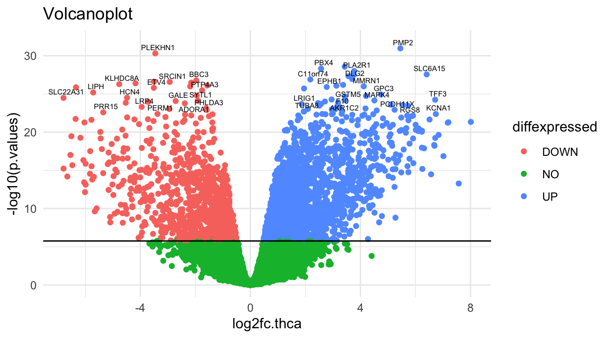

```{r setup, include=FALSE}
knitr::opts_chunk$set(echo = TRUE)
```

# Introduction

2019 starben 230,242 Menschen in Deutschland an Krebs \[Quelle\] \[[Krebsrate und Krebs-Sterberate in Deutschland (krebsinformationsdienst.de)](https://www.krebsinformationsdienst.de/tumorarten/grundlagen/krebsstatistiken.php)\]. Um Tumore zu erkennen und eine besserer Behandlung zu finden, ist die Entwicklung neuer Behandlungsmethoden von hoher Wichtigkeit. Dazu ist es essenziell die mutationstechnischen uRsachen für Krebsentwicklung zu identifizieren. Dafür können transcriptomic profiling methods wie RNA-seq verendet werden.

The provided data in the following analysis originates from a transcriptomic profiling methods like RNA-seq. Transcriptomic profiling sequences all the RNA that has been generated by transcription of the cells DNA. The difference to sequencing of DNA is, that it only sequences those genes, that are going to be expressed in that cell.

#### RNA-seq

RNA-seq is performed by cleaning of RNA, fragmentation, translation of RNA to cDNA, sequencing of cNDA and comparing with the reference genome. The advantage of RNA-seq is that it includes information about gene expression, that is especially important in the analysis of tumors such as epigenetic changes (e.g. epigenetic gene silencing) or fusion proteins.

The results from RNA-seq used for the analysis originate from the cancer genome atlas (TCGA)

## Thyroid carcinoma (THCA)

THCA incidence increased dramatically over the past few years (<https://jamanetwork.com/data/journals/intemed/936342/m_ied170005f1.png>) REFERENCE, deswegen schauen wir uns die Gene, die THCA verursachen im unserer Analyse näher an. Allerdings sind nur 1% der deutschen Tumoren THCA.

Thyroid cancers werden in verschiedene Typen aufgeteilt, der häufigste Typ ist papillary thyroid cancer (PTC) with 80% of total Thyroid cancers. The most common mutation in PTC is the V600E-Mutation of the RAF-Kinase, what causes a constant activation and by intracellular signaling it promotes tumor cell growth and thereby growth of the tumor.

Normally the Thyroid gland controls the body temperature and the metabolism.

## Hallmarks of cancer

Hallarks: was sind hallmarks? - Hallmarks sind Eigenschaften von TUmoren, die in jedem Tumor nachgewiesen werden können. Dazu gehören unter anderen die folgenden EIgenschaften: Resisting sell death, inducung angiogenesis, enabling replicative immortality, activating invasion and metastasis evading growth surpressors. Diese wurden zuerst von Hanahan und Weinberg 2011 veröffentlicht. Im laufe der Zeit kommen immer mehr hallmakrs dazu/es werden neue entdeckt. \[Quelle\]

Epigeentic profiles = auch epigenetische veränderungen werden in die Expressionsdate mit inebezogen, das wäre sehr sinnvol für die ANalyse, wird hier aber nicht beachetet

Was ist unsere Fragestellung?? und warum ist genau die so interessant?? und wie haben wir das erreicht=

## Computational tools

GSE methods um gene zu analysieren die bei RNA- seq analyse´siert wurden (fangen an mit einer ranked gene list =>x single enrichment score für jedes Geneset (2 genesets werden verglichen also zb normales und tumorgewebe)

#### Gene Set Variation Analysis (GSVA)

Eine Form von Gene set ebrichment analysis

schätzt die veränderung Pathway aktivität eine Population, unsupervised = kleine Verönderung der ptahwayaktivität werden erkannt

Analyse muss für froße, heterogene populationen mit komplexen phänotypischen Merkmalen möglich sein

=> Lösung GSVA: nicht-parametrisch, unsupervised

1.  input: gene expression matrix mit rna seq counts in unserem Fall
2.  ERstellen der Gene expression level statistic von Gen i in einem sammple durch Berechnen der kumulativen Verteilungsfunktion von allen Genexpressionsdaten
3.  Ranke der gene expression statistics
4.  Kolmogorov-Smirnov-like rank statistic wird für jedes gene set berechnet

#### Gene Set Enrichment Analysis-

die GSEA wird mit dem glleichen Zielgenutzt wie die GSVA

#### UMAP (**Uniform Manifold Approximation and Projection for Dimension Reduction)**

The UMAP is a method to reduce the dimension of a multidimensional data set. Compared to the PCA, the structure of the data in higher dimensions is maintained. Thereby the UMAP keeps the overall structure of the data set.

The problem of the UMAP is, that although the overall structure is conserved, the distance between the individual points is not proportional to the real distance in the data set.

kleine KLumpen sind wahrscheinlcich auch im richtigen RAum zusammen

#### PCA (Principle component analysis)

The package xxx is used.

Reduce the dimension of a given data set. The dimensions are summarized in principal components (PCs) which do not correlate. Because the PCs summarize the dimensions, the first PCs explain most of the variance of the data set and thereby can be selected to explain the data. Still, one has to keep in mind, that by reducing the dimensions, not all of the variance is explained and some of the information is lost in the process. The ideal number of PCs can be determined with an elbow-plot. In our analysis we use a PCA as a foundation for the UMAP, because the UMAP can not work with correlated dimensions. Furthermore it is used to detect the most important pathways, which explain most of the first PCs.

### Jaccard index

The Jaccard index is the Intersection, divided by the union of two sets.

# Material and Methods

## Our data sets (including our metabolic pathways)

For the analysis 4 data sets were provided.

1)  Gene expression data frame: The Gene expression data frame contains 60,000 genes and and their expression in 10,000 patients, and derived from The Cancer Genome Atlas (TCGA). The expression of those genes was obtained by RNA-seq HIER KOMMT NOCH DIE EINHEIT HIN
2)  Clinical annotations: The second data frame contains 37 clinical annotations like Tumor type, age, gender, etc. concerning the 10,000 patients fro the Gene expression data frame.
3)  Data for focused analysis: The third object contains 5 lists, one for each tumor type (BRCA, KIRC, LUAD, PRAD, THCA). For the focused analysis the THCA data was used. The list contains 3 data frames, each one with information about the same 60 patients. The first one with gene expression data from THCA tissue, the second one from normal tissue and the third one contains the clinical annotations like age and gender.
4)  Hallmark gene sets: A R object containing 46 pathways involved in phenotypes partly included in the hallmarks of cancer and the genes involved in those pathways.

SIND DIE DATEN NORMALISIERT ODER ALS COUNTS?

## Metabolic pathway selection

Furthermore metabolic pathways had to be selected from the Molecular Signature Database (MSigDB) (QUELLE) to compare them with the given Hallmark-Pathways and identify more pathways, that are important for the development of cancer. Therefore it was important, that as many genes from the selected pathways as possible are also included in the provided Hallmark pathways. To identify the relevant pathways, the intersection of genes was calculated and the genes with an intersection of at least 99% were maintained for further analysis.

```{r showhistcanonical, echo=FALSE, eval=TRUE, out.width = '100%', fig.align = "center", fig.cap="**Mean gene expression split by tumour type.** Log2-transformed gene expression values, given in transcripts per million (TPM), were averaged per tumour type and visualised in a violin plot."}

knitr::include_graphics("tcga_exp_biotypes.png")

```

To avoid duplicates in between the metabolic pathways and between the Hallmark pathways and the metabolic pathways, the pathways were checked for duplicates with the Jaccard index. Pathways with a sum of Jaccard indices beyond the 1-sigma range were discarded.

## Preprocessing

### Deleting NAs

Deleting of NAs was done with the R-function na.omit(x).

### Low-variance filtering

Low variance filtering is performed to delete genes with a low variance from the data set. To calculate the variance the r-function var(x) is used and genes with a lower variance than a certain threshold value are removed.

For focused analysis the variance of each gene in tumor tissue was calculated and genes with a low variance were deleted from the data sets for tumor and normal tissue.

### Biotype filtering

For biotype filtering the biotype of each gene was determined (protein coding, RNA,...) and compared with the biotypes of other data sets. To allow an appropriate comparison of the expression data, only biotypes were kept, that are available in a big amount in all of the data sets. The biotype can be determined with the R-function checkbiotypes(x) from the package biomaRt.

#### Selection of metabolic pathways

da eine hohe jaccard summe eine hohe überschneidung mit anderen pathways bedeutet. In einer heatmap sind hohe Jacccard indices weiß bis rot gefährbt. Ein niedriger Jaccard index ist blau gefärbt.

The test for duplicates in between the selected metabolic pathways and between the hallmark pathways and the metabolic pathways the Jaccard index and its sum was calculated. The results can be seen in Figure \@ref(fig:) and Figure \@ref(fig:).

One can see, that there are a few duplicates between the metabolic and Hallmark pathways. Similar pathways have a red box, those metabolic pathways with a great sum of Jaccard indices were discarded. The success of cleaning was checked with another heatmap and new Jaccard indices. There are only a few elements with another color than blue. It can be assumed, that the selection of relevant pathways was successful. The number of metabolic pathways could be reduced from xxx to 600.

## Descriptive analysis

### Mean-variance plot

In a mean-variance plot the variance is plotted against the mean of expression values of the single genes. Therefore, the variance and mean were calculated by the R-function var(x) and mean(x).

### Violin plot

To check the distribution of a data set and compare it with other data sets violin plots are used. Violin plots are tilted and mirrored density plots of gene expression values. The y-axis shows the gene expression value and the x-axis shows the amount of genes with a certain gene expression value.

#### Volcano plot

A volcano plot is used to identify significantly differentially expressed genes. In the following analysis a volcano plot is used to identify which genes are significantly diferentially expressed in the analysed THCA tissue, compared to the analysed normal tissue. Therefore the mean of each gene is calculated for normal and THCA tissue and used for the calculation of the Log2-Foldchange (Log2FC) in the following way:

```{r calculate FC, eval=FALSE}
log2fc.thca = mean.thca.norm - mean.thca.tumor

```

In the next step, a two-sided t test was performed to determine the significance of a difference in expression:

```{r  ttest, eval=FALSE}

for (i in (1:nrow(thca.norm.va))){
  x <- t.test(thca.norm.va[i,], thca.tumor.va[i,], alternative = 'two.sided')$p.value
  p.values <- append(p.values, x)
}
```

To avoid the accumulation of type 1 errors, a bonferroni correction was performed. n is the number of genes in the cleaned data set for focused analysis.

```{r Bonferroni, eval = F}
bf = 1/n
alpha = 0.025
alpha.kor = alpha*bf
```

In the volcano plot the -log10 of the calculated p values is plotted against die Log2FC. Genes with a a lower p-value than the corrected alpha-value are significantly differentialy expressed. If the Log2FC is additionally higher than 0.1, the genes are significantly over expressed in tumor tissue, if the Log2FC is higher lower than -0.1, the genes are significantly under expressed in tumor tissue.

## Comparing of Pathways

After reducing the number of Genes of the Gene Expression data frame and the THCA data by data cleaning, a descriptive analysis was performed with a Mean-variance plot and five violin plots of the TGCA data frame. The descriptive analysis of the THCA data was performed with a volcano plot and the distribution of the Tumor-specific data was displayed with violin plots.

# Results

## Preprocessing

#### deleting NAs

Deletion of NAs was applied to the 2 gene expression data frames. Because the dimension of our data frames did not change during this process it was assumed, that there were no NAs in the data sets.

#### Low-variance filtering

The goal of the analysis was to itentify the genes that show a significantly different expression in certain tumor types (Pan cancer analysis) or in comparison from normal and tumor tissue (THCA Analysis). Therefore genes with a similar expression in all patients are not relevant.

The logarithm of the obtained values were displayed in a histogram shown in Figure xxx. The genes with a lower variance than -1 were omitted. The number of genes was reduced from 60,000 to 19,000 genes.

The low-variance filtering of the THCA dataset was done in a similar way. Genes with a lower variance than -1.25 were deleted. This resulted in a reduction from about 20,000 genes to 15,000 genes in the data frames for normal and tumor tissue.

#### Biotype filtering

The biotype of the genes from the selected metabolic pathways, the genes of the hallmark pathways and the genes of the gene expression matrix was determined, to keep those genes with the same biotype. Because the most genes are protein-coding, only protein-coding genes were maintained.

```{r showbiotypeshallmarks, echo=FALSE, eval=TRUE, out.width = '20%', fig.align = "center", fig.cap="**Biotypes of Hallamrk genes**"}

knitr::include_graphics("tcga_exp_biotypes.png")

```

```{r showbiotypesexp, echo=FALSE, eval=TRUE, out.width = '20%', fig.align = "center", fig.cap="**Biotypes of Gene expression Data frame**"}

knitr::include_graphics("tcga_exp_biotypes.png")

```

```{r showbiotypesmetabolic, echo=FALSE, eval=TRUE, out.width = '20%', fig.align = "center", fig.cap="**Biotypes of metabolic pathways**"}

knitr::include_graphics("tcga_exp_biotypes.png")

```

### Descriptive analysis

#### Mean-variance Plot

In the mean-variance plot, displayed in Figure \@ref(fig:showmeanvariance), genes with a very high variance and non-zero mean were annotated their ensemble ids.

```{r showmeanvariance, echo=FALSE, eval=TRUE, out.width='30%', fig.align='center', fig.cap="Mean-variance plot of cleaned TCGA expression data. Y-axis shows variance of a genes expression, x-axis shows mean of a genes expression"}

knitr::include_graphics("Variance_over mean_cleaned_matrix.png")

```


#### Violin Plots

For descriptive analysis 5 violin plots were created for 5 different tumor types with the gene expression data from the TCGA Matrix, to compare the distribution of the data of 5 different tumor types. The violinplot can be seen in Figure \@ref(fig:showviolinplots). The white point in the middle of each plot shows the 50% quantile. For all tumor types it is located in the middle of the gene expression value 0 and 5. In this area is also the highest amount of genes for every tumor type. Going to the top or bottom the curve flattens because only a few genes are expression very high or very low. One can see, that the the distributions of all 5 tumor types are very similar. It can be concluded, that the other 28 tumor types of this data set are distributed in a similar way.

```{r showviolinplots, echo=FALSE, eval=TRUE, out.width='30%', fig.align='center', fig.cap="Mean-variance plot of cleaned TCGA expression data"}

knitr::include_graphics("Vioplots cancer types.png")

```

#### Volcano plot

For the construction of the volcano plot the data for THCA from the data set for the focused analysis was used. The volcano plot is displayed in Figure \@ref(fig:showvolcanoplot). Not significantly differentially expressed genes were marked green, significantly over expressed genes are marked blue and significantly under expressed genes are marked red. The gene with a very low p-value differ the most from tumor to normal tissue and are annotated with their name.

```{r showvolcanoplot, echo=FALSE, eval=TRUE, out.width='30%', fig.align='center', fig.cap="Volcano plot of THCA expression data"}



```

### Ergebnisse von der GSEA, GSVA, UMAP, PCA, Regression analysis
