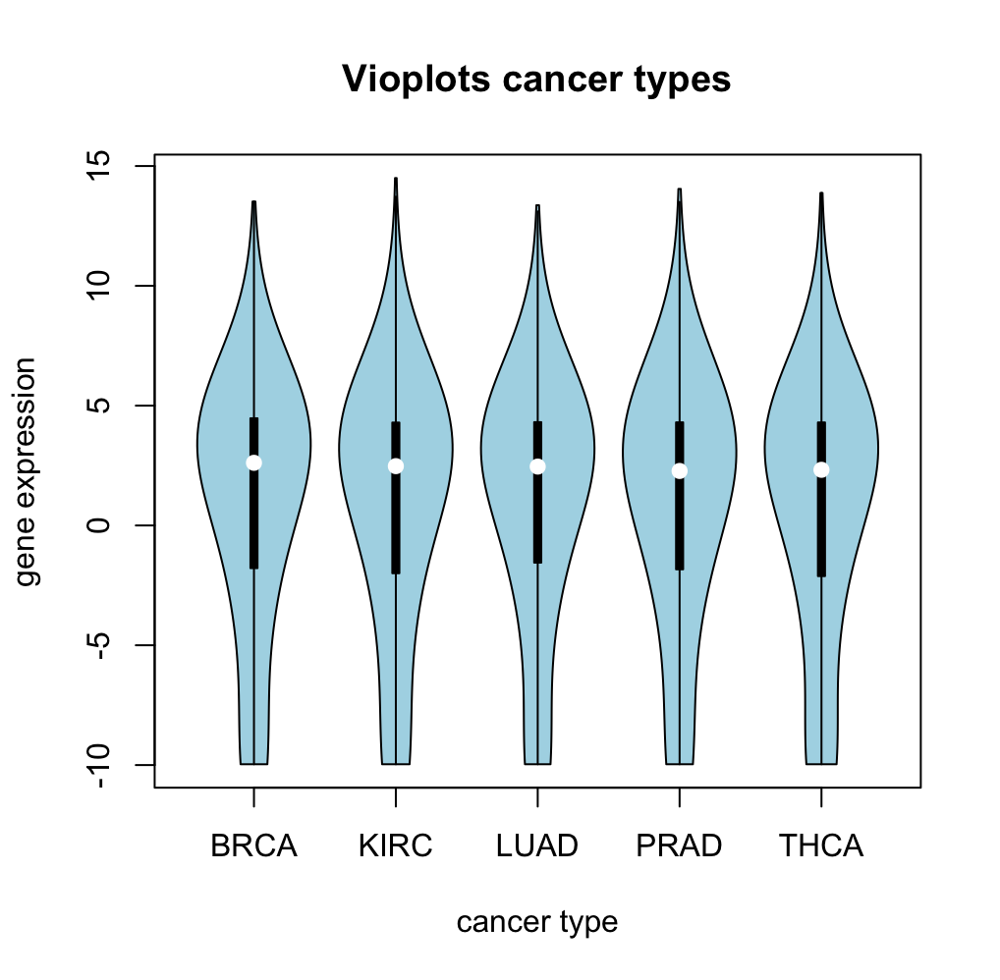

```{r setup, include=FALSE}
knitr::opts_chunk$set(echo = TRUE)
```

# Introduction

## THCA

## Hallmarks of cancer

## Our data sets (including our metabolic pathways)

For the analysis 4 data sets were provided.

1)  Gene expression data frame: The Gene expression data frame contains 60,000 genes and and their expression in 10,000 patients, and derived from The Cancer Genome Atlas (TCGA). The expression of those genes was obtained by RNA-seq HIER KOMMT NOCH DIE EINHEIT HIN
2)  Clinical annotations: The second data frame contains 37 clinical annotations like Tumor type, age, gender, etc. concerning the 10,000 patients fro the Gene expression data frame.
3)  Data for focused analysis: The third object contains 5 lists, one for each tumor type (BRCA, KIRC, LUAD, PRAD, THCA). For the focused analysis the THCA data was used. The list contains 3 data frames, each one with information about the same 60 patients. The first one with gene expression data from THCA tissue, the second one from normal tissue and the third one contains the clinical annotations like age and gender.
4)  Hallmark gene sets: A R object containing 46 pathways involved in phenotypes partly included in the hallmarks of cancer and the genes involved in those pathways.

# Analysis

## Preprocessing

#### deleting NAs

For data cleaning the Gene expression data frame and the THCA expression data frame were checked for NAs, to delete them with the R-function na.omit(). There were no NAs found.

#### Low-variance filtering

The goal of the analysis was to intentify the genes that show a significantly different expression in certain tumor types (Pan cancer analysis) or in comparison from normal and tumor tissue (THCA Analysis). Therefore genes with a similar expression in all patients are not relevant.

The next step was the filtering of the Gene expression data frame to obtain only those genes, that differ significantly in their expression. Therefore the Variances of all genes was calculated with the R-function var(). The logarithm of the obtained values were displayed in a histogram shown in Figure xxx. The genes with a lower variance than -1 were omitted. The number of genes was reduced from 60,000 to 19,000 genes.

The low-variance filtering of the THCA dataset was done in a similar way. First the variance of each gene in tumor tissue was calculated and the logarithm was displayed in the histogram shown in figure xxx. Genes with a lower variance than -1.25 were deleted in the expression data of normal and tumor tissue. This resulted in a reduction from about 20,000 genes to 15,000 genes in the data frames for normal and tumor tissue.

#### Biotype filtering

Der biotype von unseren pathways, den hallmarks und der genexpressionsmatrix wurde bestimmt, um Gene mit ähnlichen biotypes zu behalten. Zur Bestimmung des Biotypes wurde eine Funktion erstellt, die den Gennamen als Input nimmt und Die Biotypes wurde in 3 Histogrammen in Figure \@ref(fig:showbiotypeshallmarks), Figure \@ref(fig:showbiotypesexp) und Figure \@ref(fig:showbiotypesmetabolic) dargestellt. Da die meisten Gene aller Datensätze protein-codierend sind, wurden nur die proteincodierenden Gene behalten.

```{r showbiotypeshallmarks, echo=FALSE, eval=TRUE, out.width = '50%', fig.align = "center", fig.cap="**Biotypes of Hallamrk genes**"}


```

```{r showbiotypesexp, echo=FALSE, eval=TRUE, out.width = '50%', fig.align = "center", fig.cap="**Biotypes of Gene expression Data frame**"}


```

```{r showbiotypesmetabolic, echo=FALSE, eval=TRUE, out.width = '50%', fig.align = "center", fig.cap="**Biotypes of metabolic pathways**"}


```

#### Jaccard Index

#### metabolic pathway selection

Furthermore 600 pathways were selected from the Molecular Signatur Database (MSigDB) (QUELLE)

um die mit den HAllmark pathwayszu vergleichen und weiter wichtige pathways für cancer zu identifizieren

dafür war es wichtig, dass die möglcihst viele gene aus den pathways in den hallmarks enthalten waren, um deren expression zu vergleichen

um die relevaten pathways herauszusuchen wurde die uberschenidung der gene ausgerechnet und in einem histogramm dargestellt, das in Figure \@ref(fig:showhistcanonical) dargestellt ist. Pathways mit einer Überschneidung von mindestens 99% wurden für die weitere Analyse verwendet.

```{r Selection of canonical pathways, echo=TRUE, eval=FALSE}
load('data/tcga_genes_cleaned.RData')
coverage = sapply(pathway_list, FUN = function(x){
              enthalten = x %in% tcga_genes_cleaned$tcga_geneids
              res = sum(enthalten)/length(enthalten)
              return(res)
            })
our_genesets = pathway_list[which(unname(coverage >= 0.99))]

```

```{r showhistcanonical, echo=FALSE, eval=TRUE, out.width = '100%', fig.align = "center", fig.cap="**Mean gene expression split by tumour type.** Log2-transformed gene expression values, given in transcripts per million (TPM), were averaged per tumour type and visualised in a violin plot."}


```

Um dopplungen innerhalb der gewählten Pathways zu vermeiden wurden diese mithilfe vom Jaccard index auf Überschneidungen überprüft und in Figure \@ref(fig:showheatmapjaccardmetabolic) als heatmap dargestellt. Es ist zu sehen, dass sich einige pathways überschneiden. Um die Pathways mit den meisten Dopplungen zu entfernen, wurde die Summe der Jaccard-Indices der einzelnen pathways verglichen. Eine hohe SUmme bedeutet hier, dass es viele Dopplungen gibt und ist in der heatmap als weiß bis rotes Element dargestellt. Die Pathways, die im 1sigma Bereich liegen, wurden behalten, alle anderen entfernt. Der Erfolg des cleanings wurde mit einer Heatmap überprüft, die in Figure \@ref(fig:showheatmapaftercleaningmetabolic) zu sehen ist.

Um Dopplungen von Hallmark Pathways und den gewählten pathways zu vermeiden wurde auch zwischen diesen Pathways jeweils der Jaccard-index erstellt und in Figure \@ref(fig:) als Heatmap dargestellt. Auch hier wurden nur die Pathways behalten, deren Ähnlichkeit innerhalb des 1-Siga-Bereichs liegt. Das Ergebnis wurde auch als Heatmap in Figure \@ref(fig:) dargestellt. Es sind keine Dopplungen mehr vorhanden, es wurden etwa 600 Pathways erhlten, die für die weitere Analyse verwendet werden können.

```{r showheatmapjaccardmetabolic, echo=FALSE, eval=TRUE, out.width='50%', fig.align='center', fig.cap="Jaccard index of metabolic pathways against each other"}


```

```{r showheatmapaftercleaningmetabolic, echo=FALSE, eval=TRUE, out.width='70%', fig.align='center', fig.cap="Jaccard index of metabolic pathways against each other after cleaning"}

knitr::include_graphics("Pathways_richtig_gecleand.png")

```

## Descriptive Analysis

After reducing the number of Genes of the Gene Expression data frame and the THCA data by data cleaning, a descriptive analysis was performed with a Mean-variance plot and five violin plots of the TGCA data frame. The descriptive analysis of the THCA data was performed with a volcano plot and the distribution of the Tumor-specific data was displayed with violin plots.

#### Mean-variance Plot

In the mean-variance plot, displayed in Figure \@ref(fig:showmeanvariance), wurde die Varianz der Expression der einzelnen Gene über deren Mittelwerte geplottet. Gene mit einer besonders hohen Varianz und non-zero mean wurden in Figure \@ref(fig:showmeanvariance) markiert. Für die weitere Analyse wäre es interessant, sich diese Gene und ihre Expression in Tumoren genauer anzuschauen.

```{r showmeanvariance, echo=FALSE, eval=TRUE, out.width='70%', fig.align='center', fig.cap="Mean-variance plot of cleaned TCGA expression data"}

knitr::include_graphics("Variance_over mean_cleaned_matrix.png")

```


#### Violin Plots

Zur descriptive analysis wurde außerdem ein Violinplo für 5 verschieden Tumortypes aus der TCGA Matrix erstellt. Der Zweck dieser Plots ist es, die Verteilungen der GEnexpression der verschiedenen Tumortypen zu überprüfen. Dafür wurde zuerst der MEdian der einzelnen Tumortypen berechnet und im ncähsten Schritt ein Violinplot erstellt the violinplot can be seen in Figure \@ref(fig:showviolinplots). The distribution around the plot refers to the mean of the level of gene expression across all the patients from the same tumor type. One can immediately see that a high number of genes is a very low expression level, while only a small number of genese is at a very high expression level. Overall there is no great difference between the gene expression in those 5 cancer types.

```{r showviolinplots, echo=FALSE, eval=TRUE, out.width='70%', fig.align='center', fig.cap="Mean-variance plot of cleaned TCGA expression data"}



```

#### Volcano plot

To further investigate the cleaned THCA expression data a volcano plot was created. Das Ziel des volcanoplots ist es, zu zeigen, welche Gene in den THCA tissue signifikant anders eprimiert sind als in normale Gewebe. Dafür wurde der mean jedes Gens in normalem und tumorgewebe berechnet und daraus der Log2-Foldchange folgendermaßen berechnet:

```{r calculate FC, eval=FALSE}
log2fc.thca = mean.thca.norm - mean.thca.tumor

```

Im nächsten Schritt wurde ein zweiseitger t-test durchgeführt um die signifikanz des Expressionsunterscheids zu bestimmen.

```{r  ttest, eval=FALSE}

for (i in (1:nrow(thca.norm.va))){
  x <- t.test(thca.norm.va[i,], thca.tumor.va[i,], alternative = 'two.sided')$p.value
  p.values <- append(p.values, x)
}
```

Um die Akkuulation von alpha-Fehlern zu vermeiden wurde eine Bonferroni-Korrektur durchgeführt:

```{r Bonferroni, eval = F}

alpha = 0.025
alpha.kor = alpha*bf
```

Im Volcanoplot wurden die p-Werte vom ttest gegen den Log2 Foldchange geplottet. Dieser ist in Figure \@ref(fig:) dargestellt.
