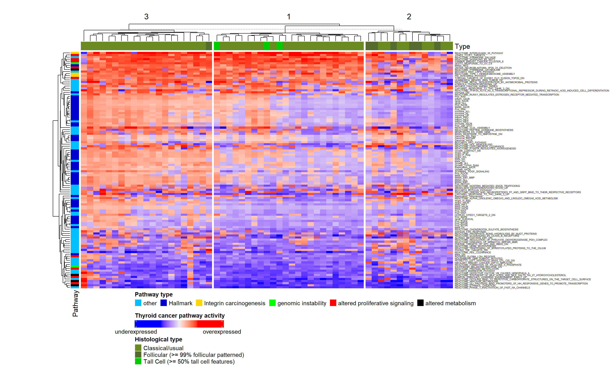
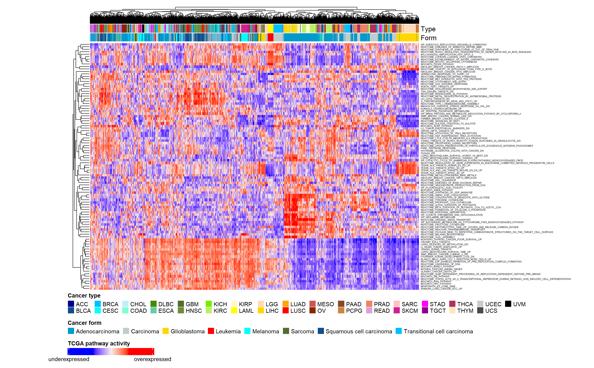
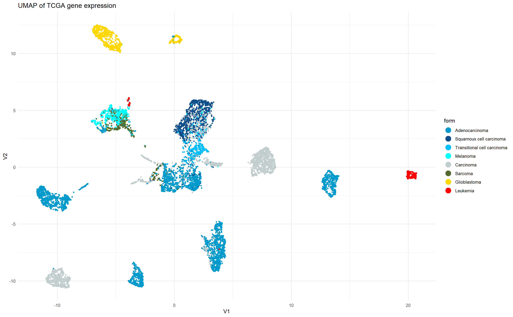
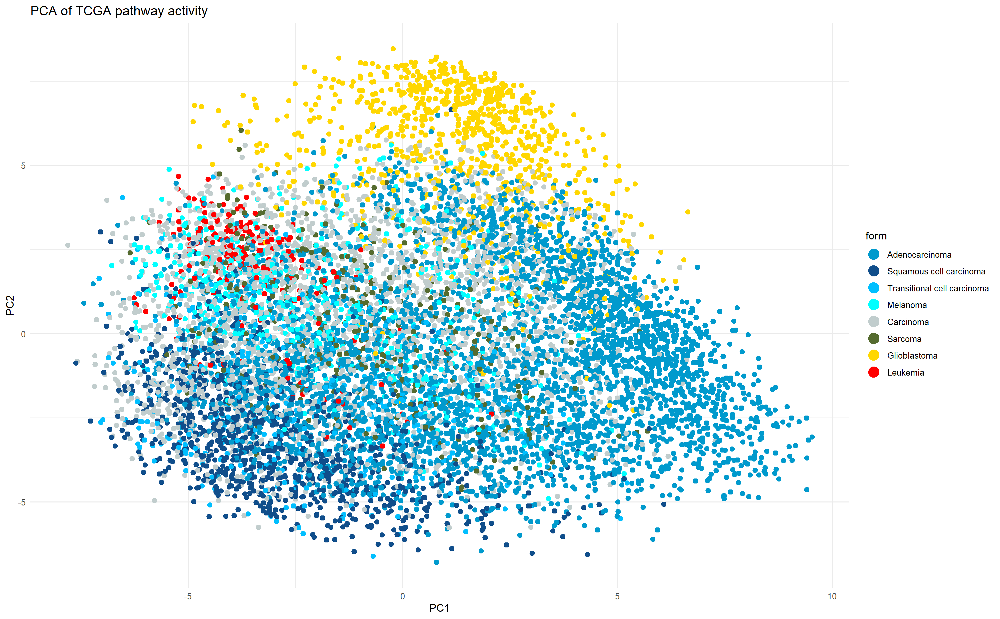

---
output:
  pdf_document: default
  html_document: default
---

# Supplementary material

## Additional Computational Methods

A Principal component analysis (PCA) xxx QUELLE is used to alter the coordinates of a given dataset to its eigenvectors. This matrix rotation results in a new set of basis vectors called principal components (PCs) - the eigenvectors - that are orthogonal and show little correlation. Sorting the PCs by their associated eigenvalue, the PCs explaining the most variance can easily be identified, as they have the highest eigenvalue. By displaying the data set in a coordinate system span by the $n$ most variant PCs, the dimensionalty of the data set is reduced to $\mathbb{R}^n$ with the lowest loss in variance.

Linear regression is a statistical model that uses measurable values to predict an outcome. For this purpose, a linear function serves as basis to build the linear regression equation [@lm]. The coefficients for each variable are estimated by their correlation and slope with the predicted parameter. Lastly, all coefficients as well as the intersect are optimized for the data set with a least sum of squares method.

## Additional Figures

```{r reg, echo=FALSE, eval=TRUE, out.width='80%', fig.align='center', fig.cap="\\textbf{Regression results for various models on THCA GSEA test data.} True values are plotted against predicted values, black slope indicate a perfect prediction."}

knitr::include_graphics("figures/Regression comparison plot IL36 genes.png")
```

```{r pval, echo=FALSE, eval=TRUE, out.width='30%', fig.align='center', fig.cap="\\textbf{F-test comparison of various regression models.} p-values are obtained from a two-sided variance test and displayed as heatmap. nn = neuronal network, lm = linear regression, lmsp = linear regression with only significant pathways, null = null model."}

knitr::include_graphics("figures/Regression comparison Pvalues IL36 genes.png")
```

```{r THCAhmGSEA, echo=FALSE, eval=TRUE, out.width='100%', fig.align='center', fig.cap="\\textbf{Pathway activity of the 50 most variant, hallmark, and 20 most significantly altered pathways for each patient.} Column clusters were obtained by k-means clustering with k=3. Pathway activities were computed via GSEA of THCA expression data. For all pathway activities see figure (XXX in the apendix)."}


```

```{r UMAPPanForm, echo=FALSE, eval=TRUE, out.width='80%', fig.align='center', fig.cap="\\textbf{UMAP of TCGA pathway activity,} colored by histological type"}

knitr::include_graphics("figures/Pan Cancer UMAP cancer form.png")
```

```{r exp, echo=FALSE, eval=TRUE, out.width='100%', fig.align='center', fig.cap="\\textbf{Pathway activity of the 100 most variant pathways for each patient.} Column and row clusters were obtained by complete hierachical clustering. Pathway activities were computed via GSVA of pan-cancer expression data. For all pathway activities see figure (XXX in the apendix)."}


```

```{r showmeanvariance, echo=FALSE, eval=TRUE, out.width='65%', fig.align='center', fig.cap="\\textbf{Mean-variance plot of cleaned TCGA expression data.} Y-axis shows variance of a gene expression, x-axis shows the log2 mean of a gene expression. Genes with variance greater 33 are labelled with their ENSEMBL-ID"}

knitr::include_graphics("figures/Variance_over mean_cleaned_matrix.png")

```

```{r UMAPGenform, echo=FALSE, eval=TRUE, out.width='100%', fig.align='center', fig.cap="\\textbf{UMAP performed for gene expression data,} colored by hiytological type"}



```

```{r PCAcancerform, echo=FALSE, eval=TRUE, out.width='100%', fig.align='center', fig.cap="\\textbf{Results of PCA,} PC 1 and 2 are shown, samples are colored by histological type."}



```

## Packages

```{r, eval =TRUE, echo=FALSE, results='hide'}
library(readxl)
packages <- read_excel("C:/Users/jakob/Documents/GitHub/2022-topic-02-team-05/markdown/PackagesRProjekt.xlsx")
```

```{r packagesused, eval = TRUE, echo=FALSE}

knitr::kable(packages, format = "markdown", caption= "Packages used in the analysis.")
```
