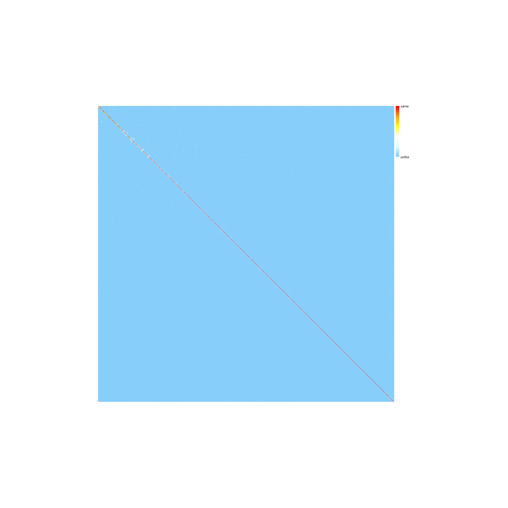
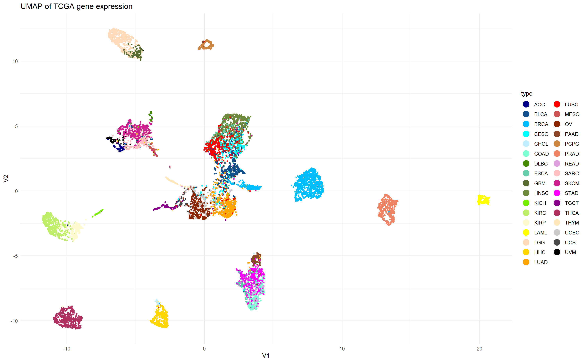
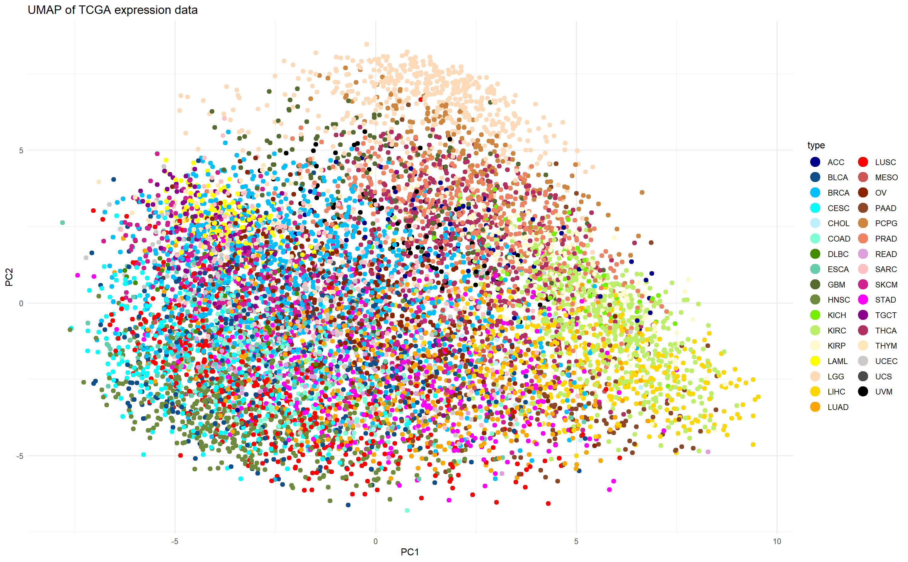

---
output:
  pdf_document: default
  html_document: default
---

# Appendix

## Plots

```{r Jaccarddirtea, echo=FALSE, eval=TRUE, out.width='80%', fig.align='center', fig.cap="Heatmap, displaying jaccard index obtained by caomparing uncleaned metabolic pathways. Pathways with a high Jaccard index are colored red to white. Pathways without similarity are colored blue."}

knitr::include_graphics("figures/appendix/Similarity_of_selected_pathways.png")

```

```{r Jaccardcleaned, echo=FALSE, eval=TRUE, out.width='110%', fig.align='center', fig.cap="Heatmap, displaying jaccard index obtained by comparing cleaned metabolic pathways. Pathways with a high Jaccard index are colored red to white. Pathways with low similarity are colored blue."}


```

```{r UMAPGen, echo=FALSE, eval=TRUE, out.width='100%', fig.align='center', fig.cap="UMAP performed for gene expression data, colored by cancer type"}



```

```{r UMAPGenform, echo=FALSE, eval=TRUE, out.width='100%', fig.align='center', fig.cap="UMAP performed for gene expression data, colored by hiytological type"}

knitr::include_graphics("figures/appendix/Pan Cancer Geneexpression UMAP cancer form.png")

```

```{r PCAcancerform, echo=FALSE, eval=TRUE, out.width='100%', fig.align='center', fig.cap="Results of PCA, PC 1 and 2 are shown, samples are colored by histological type."}

knitr::include_graphics("figures/appendix/Pan Cancer PCA PC1und2 cancer form.png")

```

```{r PCAcancertype, echo=FALSE, eval=TRUE, out.width='100%', fig.align='center', fig.cap="Results of PCA, PC 1 and 2 are shown, samples are colored by cancer type."}



```

## Packages

```{r, eval =TRUE, echo=FALSE, results='hide'}
library(readxl)
packages <- read_excel("~/GitHub/2022-topic-02-team-05/markdown/PackagesRProjekt.xlsx")
```

```{r packagesused, eval = TRUE, echo=FALSE}

knitr::kable(packages, format = "markdown", caption= "Packages used in the analysis.")
```
