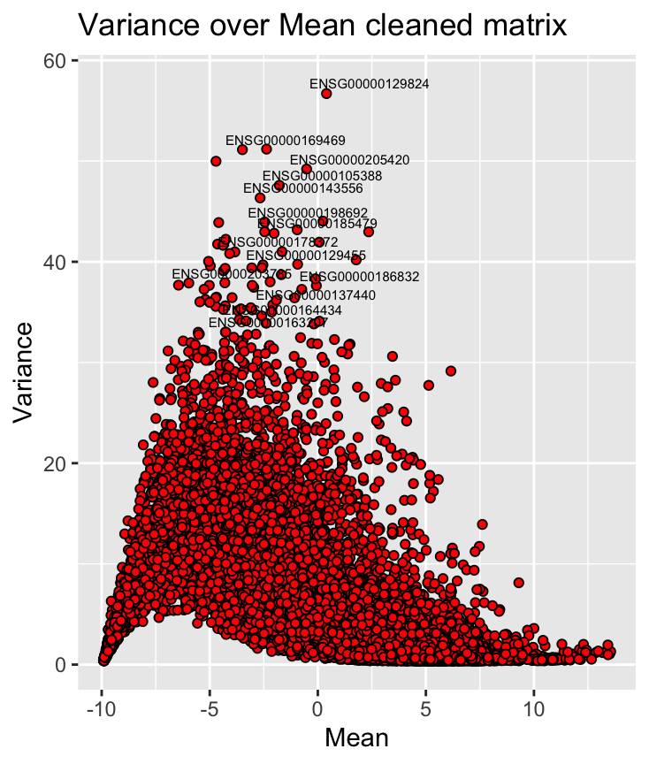
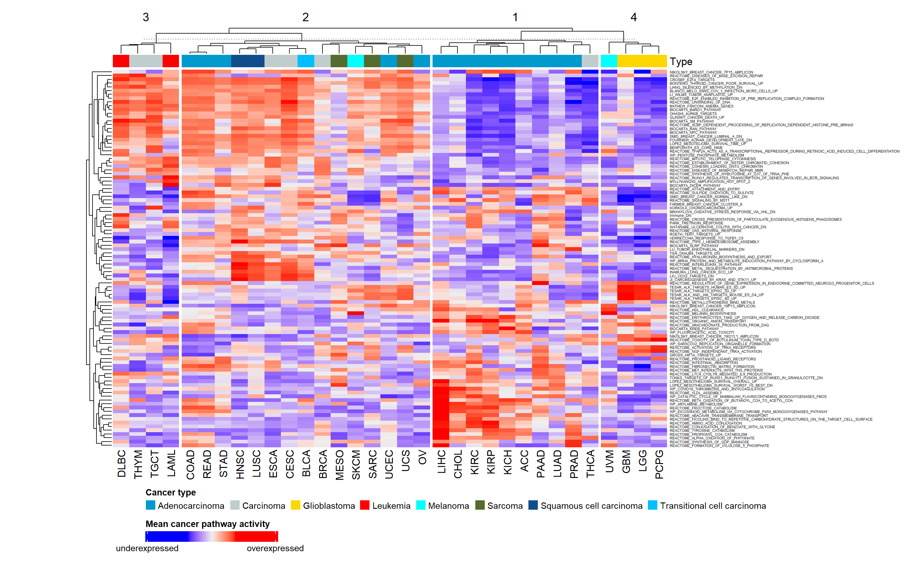
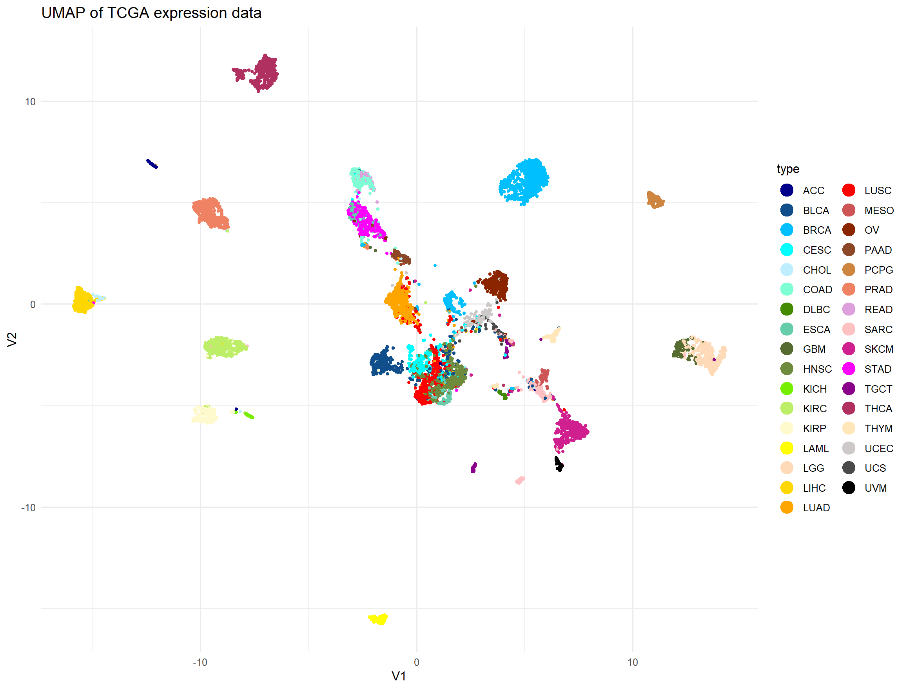
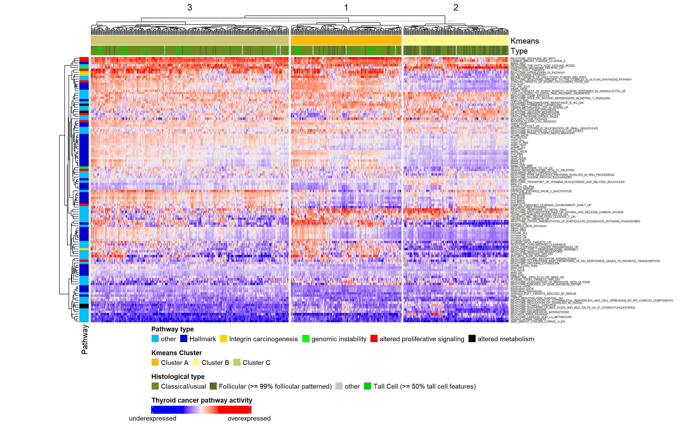
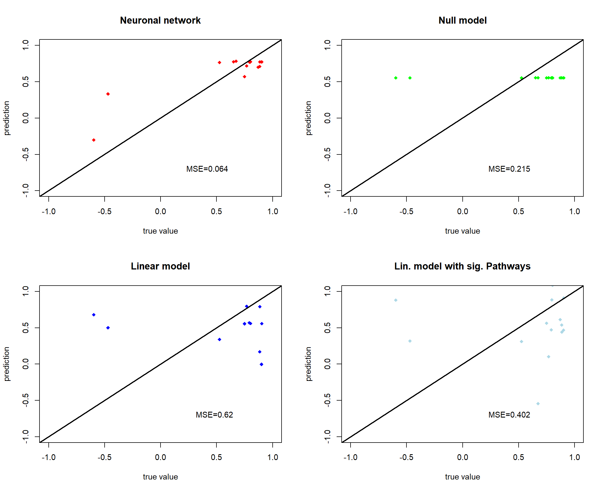

---
editor_options:
  markdown:
    wrap: 72
output:
  pdf_document:
    df_print: paged
---
# Results
## Preprocessing
**Dimension reduction through low-variance and biotype filtering**
All dataframes were checked for NAs, which were subsequently deleted.
Genes with a variance lower than 0.1 were removed to reduce
dimensionality, as they contribute very little to the overall variance
of the data set and are most likely house-keeping genes. The
low-variance filtering of the THCA data set was done in a similar way.
Genes with a lower variance than 0.06 were deleted in the tumor tissue
and the normal tissue data. To reduce dimensionality further, we
determined the biotypes of the hallmark pathway genes, which was almost
exclusively protein coding. To match this, only protein coding pathways
were kept in all expression data sets for further analysis. Doing so,
the number of genes in the pan-caner data set was reduced from 60,000 to
approximately 19,000 genes and from approximately 20,000 genes to 15,000
genes in both THCA data frames.
**MSigDB pathway filtering**
The pathways from the MSigDB database were first aligned with the genes
in our expression data. Only pathways with a coverage of over 99% were
kept. To test for similarity in the selected metabolic pathways compared
to the hallmark pathways and the metabolic pathways themselves, the
Jaccard index between all pathways was calculated. A few MSigDB pathways
with a high Jaccard index were identified and subsequently deleted.
\ref{xxxfigure Jaccard heatmap in Apendix}. The number of MSigDB
pathways could thus be reduced from 6366 to 657.
## Descriptive analysis
**Mean-variance plot of TCGA expression data shows highly variant genes.**
To determine the genes from the TCGA expression data with a high
variance, the variance was plotted over the mean (Figure
\@ref(fig:showmeanvariance)). Additionally those genes with a variance
higher than 33 were labeled with their EnsembleID. The distribution of
genes in this plot shows that the highly variant genes are around a log2
mean expression level of 0. The plot also shows, that very few genes are
at a low mean expression level or at a very high mean expression level.
Most genes are expressed across all patients at a log2 mean expression
level of approximately 0. With this plot we were able to determine which
genes differ significantly in their expression level across all cancer
patients.
```{r showmeanvariance, echo=FALSE, eval=TRUE, out.width='65%', fig.align='center', fig.cap="Mean-variance plot of cleaned TCGA expression data. Y-axis shows variance of a gene expression, x-axis shows the log2 mean of a gene expression. Genes with variance greater 33 are labelled with their ENSEMBL-ID"}



```
**Significantly up- and down regulated genes in THCA obtained from volcano plots**
To determine those genes that are up- or down-regulated in THCA, the
expression data from tumor tissue was compared to the data from normal
tissue by mean log2 fold change. Associated p-Values were comuted with a
Wilcoxon rank sum test. (Figure \@ref(fig:showvolcanoplot)). The
significance level adjusted to 1.755e-06 with a Bonferrioni adjustment.
```{r showvolcanoplot, echo=FALSE, eval=TRUE, out.width='100%', fig.align='center', fig.cap="Volcano plot of THCA expression data. Downregulated genes are colored red, upregulated genes blue. Not significantly altered genes are colored green. Most significantly altered genes are labelled with their gene symbol"}

knitr::include_graphics("figures/Volcanoplot.png")

```
## Pan cancer analysis
**GSVA of TCGA expression data reveals four clusters of cancer types.**
To find general clusters a heatmap with the mean expression of each gene
in each tumor type was generated and clustered hierarchically. Figure
\@ref(fig:meanexp) and \@ref(fig:exp)
The tumor types were clustered based on their mean pathway activity and
formed four clusters correlating with their histological type. The first
cluster contains mainly adenocarcinamas, while the second one contains
predominately glioblastomas. Leukemias are only found in the third
cluster and the last cluster is enriched with sarcomas and carcinomas.
Melanomas appear in the second and fourth cluster.
Furthermore, three observations were made regarding specific information
about pathway activity.
Pathways, which are important for nucleus import and export like
Nasopharygeal carcinoma (NPC) and Ran shuttle pathways, as well as
pathways for transcription regulaturs in embryonic stem cells are
down-regulated in glioblastoma and adenocarcinoma. However, these
pathways are up-regulated in all other histological types. This
seperation into two clusters is in line with the research of Ben-Porath
et al., that shows an embryonic stem cell-like gene expression only in
poorly differentiated tumors, such as leukemia [@result5]. In that way
it could be conluded that the differentation stage of a tumor correlates
with pathway activty specific to certain histological types
\@ref(fig:meanexp).
Another observation is the clustering of glioblastoma. Pathways
initiating neurogenesis and pathways linked to differentiation of the
neural crest are up-regulated only in glioblastoma [@result6]. Two other
pathways, that are up-regulated in glioblastoma cells are pathways
linked to the activity of tyrosine kinases. The up-regulation of
tyrosine kinases promote cell growth and proliferation. [@cell]. Taken
together these two observations are in line with the expected high
proliferation rate commonly found in glioblastoma.
The third cluster is mainly related to adenocarcinomas, more
specifically liver hepatocellular carcinoma (LIHC), kidney renal
papillary cell carcinoma (KICH) and kidney renal clear cell carcinoma
(KIRC). The up-regulated pathways are involved in metabolism of
carbohydrates, synthesis of lipids, synthesis of amino acids and
detoxification. An up-regulation of all of these pathways may lead to
cell growth and proliferation, due to higher metabolic activity,
providing more biomass and energy.
```{r meanexp, echo=FALSE, eval=TRUE, out.width='100%', fig.align='center', fig.cap="Mean pathway activity of the 100 most variant pathways for each tumor type. Column clusters were obtained by complete hierachical clustering and subsequently split into four groups. Pathway activities were computed via GSVA of pan-cancer expression data. For all pathway activities see figure (XXX in the apendix)."}


```
```{r exp, echo=FALSE, eval=TRUE, out.width='100%', fig.align='center', fig.cap="Pathway activity of the 100 most variant pathways for each patient. Column and row clusters were obtained by complete hierachical clustering. Pathway activities were computed via GSVA of pan-cancer expression data. For all pathway activities see figure (XXX in the apendix)."}

knitr::include_graphics(
  "figures/Pan Cancer GSVA Heatmap neu und fertig top 100 Pathways.png")
```
**Dimension reduction of GSVA pan-cancer data reveals clusters in pathway activity.**
PCA was performed on GSVA pan-cacner data to provide uncorrelted
varibales for better UMAP analysis. No apparent clustering was observed
only in PCA data (compare Figure xxx supplementray materail). Subsequent
UMAP analysis however, showed clear clusters for most cancer types.
\@ref(fig:UMAPPanType) \@ref(fig:UMAPPanForm). This complemetns the
results obtained from our heatmap and reassures, that the tumor types
have characteristic pathway activities. However, some cancers cluster
better with their histological type rather than tumor type. This was
observed mainly for carcinomas like squamous cell carcinoma and
transitional cell carcinoma, as well as sarcoma, lung adenocarcinoma and
ovarian cancer. These are the same histological types that proofed
difficult to cluster in the mean GSVA of TCGA expression. The UMAP
confirmed the assumption, that the histological type of a tumor has a
major impact on the patients gene expression profile.
```{r UMAPPanType, echo=FALSE, eval=TRUE, out.width='80%', fig.align='center', fig.cap="UMAP of TCGA pathway activity, colored by tumor type"}


```
```{r UMAPPanForm, echo=FALSE, eval=TRUE, out.width='80%', fig.align='center', fig.cap="UMAP of TCGA pathway activity, colored by histological type"}

knitr::include_graphics("figures/Pan Cancer UMAP cancer form.png")
```
The same analysis was performed for gene expression activity instead of
pathway activity to check for reliability of the results. Similar
clusters were observed, which confirms our results (see Fig.
appendix)xxx.
## Focused analysis
**GSVA on THCA expression data reveals pathways driving thyroid carcinogenesis.**
To grasp a general overview of the differences in pathway activity
between THCA and homeostatic thyroid tissue, GSVA was performed for the
THCA expression data. Then, changes in pathway activity were computed by
log2 fold change and the respective p-values were computed by a Wilcoxon
rank-sum test. The most significantly altered pathways were then
characterized. \@ref(fig:THCAvolcano) Most prominently among them were
pathways linked to proliferative signaling such as upregulation of p53
inhibitory proteins and hedgehog pathway activating Gli proteins.
Further, the alpha6beta4 integrin signaling pathway and associated
pathways such as IL-36 signaling and Typ I hemidesmosome synthesis were
significantly enhanced in THCA. These findings are consistent with
previous studies that linked alpha6beta4 signaling to the development of
aggressive forms of thyroid cancer [@result4,@result3]. Also, oncogenic
signaling pathways commonly associated with different cancer types were
significantly upregulated in THCAs. Among them, we observed ERBB2 and
MST1 signaling commonly found in breast cancer. A role for MSP/Ron in
breast cancer has recently been elucidated, wherein this pathway
regulates tumor growth, angiogenesis and metastasis [@result2].
Further, signaling through the EWSR1/FLI1-fusion protein was
significantly upregulated in THCA. Lastly, THCAs showed downregulation
of non-histone protein methylation. This process was identified as an
import modulator of intracellular signaling by the MAPK, WNT, BMP,
Hippo, and JAK/STAT pathways and might play an important role as a
driver of carcinogenesis in THCA [@result1]. Together these findings
give a general overview of mechanisms driving carcinogenesis in THCA.
However, no information about possible THCA subtypes or differences in
patway activity between patients can be obtained from this data.
```{r THCAvolcano, echo=FALSE, eval=TRUE, out.width='100%', fig.align='center', fig.cap="Volcano plot of THCA pathway activity. Downregulated pathways are colored red, upregulated pathways blue. Not significantly altered pathways are colored green. Most significantly altered pathways are labelled with their name."}

knitr::include_graphics("figures/Volcanoplot THCA GSVA data.png")
```
**Pan-cancer data GSVA reveals three subtypes of THCA altering in proliferative signaling.**
To investigate potential subtypes of THCA, the respective samples were
taken from the pan-cancer GSVA data. The optimal number of clusters was
determined by an elbow plot and subsequent K-means clustering revealed a
total of three subtypes in THCA \@ref(fig:THCAhm). This is consistent
with the three clusters of THCA observed in the full pan-cancer GSVA
data. The follicular histological type was enriched in cluster B, with
no tall cell types present in this cluster. Judging from histological
type alone no difference in clusters A and C was observed. Most
significant changes in pathway activity were observed in pathways
concerning proliferative signaling. In comparison with all other tumor
types, cluster A displayed high activity of RAS, JAK/STAT and
EWSR1/FL1-fusion mediated signaling as well as elevated signatures
associated with carcinogenesis driven by alpha6beta4 activity. In
contrast, these pathways were downregulated in cluster B, with it
showing elevated activity in mTOR, MAPK, PI3K, and EGFR signaling
cascades. Cluster C was found to upregulate all the aforementioned forms
of proliferative signaling. All clusters showed a homogenous
upregulation of hedgehog, ERBB2, and MST1 pathway activity. Regarding
immune response, cluster C showed no significant alterations in the
respective hallmark pathways, however, these pathways were downregulated
in both clusters A and B. With this data, we can identify two seemingly
different forms of proliferative signaling driving carcinogenesis in
THCA. These forms can either occur separately as in the case of clusters
A and B or combined as for cluster C.
```{r THCAhm, echo=FALSE, eval=TRUE, out.width='100%', fig.align='center', fig.cap="Pathway activity of the 50 most variant, hallmark, and 20 most significantly altered pathways for each patient. Column clusters were obtained by k-means clustering with k=3. Pathway activities were computed via GSVA of pan-cancer expression data. For all pathway activities see figure (XXX in the apendix)."}


```
**THCA subtypes do not differ in their metabolism.**
To investigate how the identified subtypes compare to homeostatic
thyroid tissue, GSEA was performed for the THCA data. Consistent with
the pan-cancer analysis of THCA data, k-means clustering obtained three
different clusters in pathway activity -- verified as the optimal number
of clusters via an elbow plot. All clusters showed a similar change in
metabolism \@ref(fig:THCAhmGSEA). Katabolic pathways are downregulated
whereas anabolic pathways e.g., fatty acid synthesis show increased
activity in comparison with normal tissue. These changes in metabolic
activity are in line with the Warburg effect. Further, the results seem
consistent with the proliferative signaling activities found previously.
Alpha6beta4, RAS, JAK/STAT, and EWSR1/FL1-fusion mediated signaling is
upregulated in clusters one and three with low expression in cluster
two. However, the expected upregulation of mTOR, MAPK, PI3K, and EGFR
signaling in clusters two and three was observed only in some samples.
Regarding, immune response the expression profiles are again consistent
with differences observed in the GSVA pan-cancer data: Both clusters one
and two show a lower immune response compared to cluster three. From
these GSEA results, we can conclude that the three subtypes of THCA
differ in carcinogenesis and associated immune response but share a
similar metabolism consistent with the Warburg effect.
```{r THCAhmGSEA, echo=FALSE, eval=TRUE, out.width='100%', fig.align='center', fig.cap="Pathway activity of the 50 most variant, hallmark, and 20 most significantly altered pathways for each patient. Column clusters were obtained by k-means clustering with k=3. Pathway activities were computed via GSEA of THCA expression data. For all pathway activities see figure (XXX in the apendix)."}

knitr::include_graphics("figures/THCA GSEA Heatmap fertig top 50.png")
```
## Regression analysis of THCA pathway activity
To select a suitable pathway for regression analysis, the top 20%
pathways regarding their variance in activity were chosen, as for the
regression model to predict. Pathways with little variance were found to
be better predicted by a null model (Fig xxx supplementary material). To
factor in biological significance, the intersect of the 25 most
significantly altered pathways from GSVA with the high variance pathways
was computed. This resulted in three significantly altered and highly
variant pathways among which the REACTOME_INTERLEUKIN_36_PATHWAY gene
set was selected. This gene set ranks 8th among the highest upregulated
pathways with an associated p-value of 8.411155e-15. As interleukin 36
signaling is connected to both MAPK activity and through the activation
of NF-kB also the expression of integrin alpha6beta4 effective
regression might be crucial in finding potentially druggable targets in
combating THCA[@result4; @result7; @msigdb].
Regression of the REACTOME_INTERLEUKIN_36_PATHWAY gene set showed mixed
results. After multiple testing an architecture with two hidden layers
with 10 and 20 neurons respectively at \` set.seed(50) \` was shown to
produce the best results for neuronal network regression. Among the
tested models, the neuronal network performed best on the test data with
a mean squared error (MSE) of 0.06. However, the linear regression model
failed to predict the data accurately (MSE = 0.62). Repeated linear
regression with just pathways contributing significantly to the result
the performance was enhanced (MSE = 0.40), however, remained worse than
a null model (MSE = +0.22). \@ref(fig:reg) Comparison of the MSE on test
an training data reveals, that linear model is highly overfitted
($\Delta$MSE = +0.55) with the linear model with significant pathways
fitting slightly better ($\Delta$MSE = +0.23) to the data. Our null
model displayed an good, yet slightly underfitted performance with
$\Delta$MSE = -0.08. With a $\Delta$MSE = +0.009 the neuronal network
shows a perfect fit.
A comparison of the four regression models via the F-test function
`var.test()` showed a significant improvement of the neuronal network
compared to all other models. All other models showed no significant
differences in their performance \@ref(fig:reg) compared to each other.
From this data, we can conclude that a neuronal network is the best
choice for most accurately predicting IL-36 pathway activity in our test
data.
```{r reg, echo=FALSE, eval=TRUE, out.width='80%', fig.align='center', fig.cap="Regression results for various models on THCA GSEA test data. True values are plotted against predicted values, black slope indicate a perfect prediction."}


```
```{r pval, echo=FALSE, eval=TRUE, out.width='30%', fig.align='center', fig.cap="F-test comparison of various regression models. p-values are obtained from a two-sided variance test and displayed as heatmap. nn = neuronal network, lm = linear regression, lmsp = linear regression with only significant pathways, null = null model."}

knitr::include_graphics("figures/Regression comparison Pvalues IL36 genes.png")
```