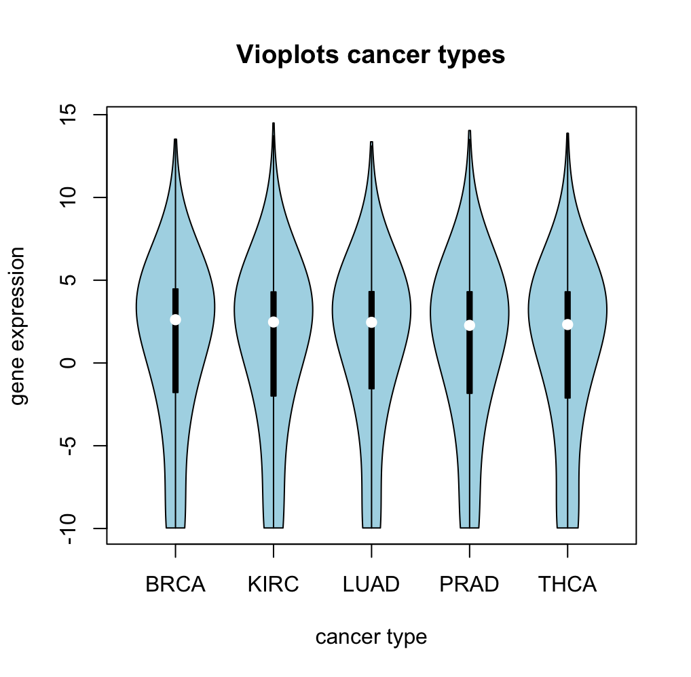
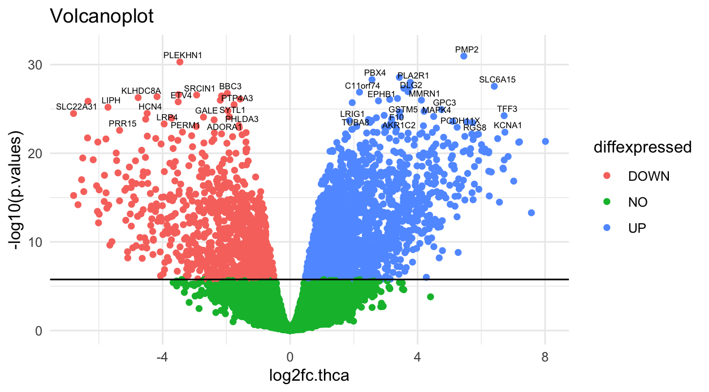
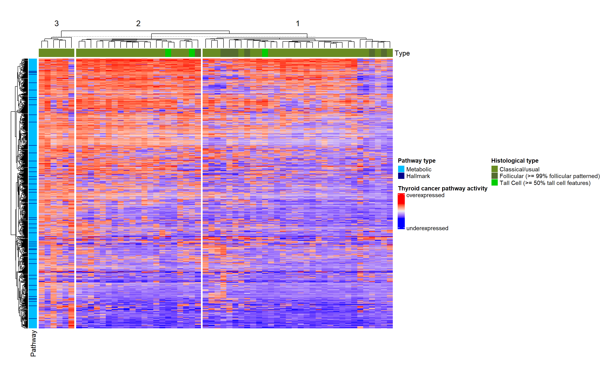
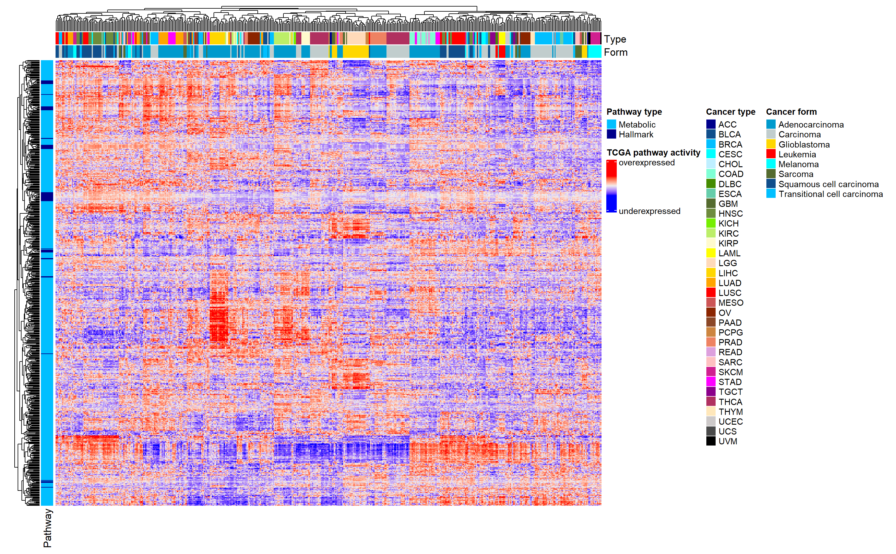
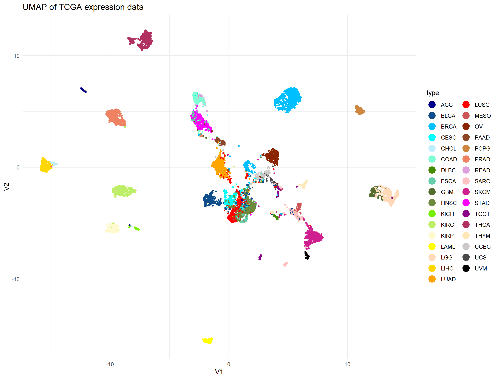
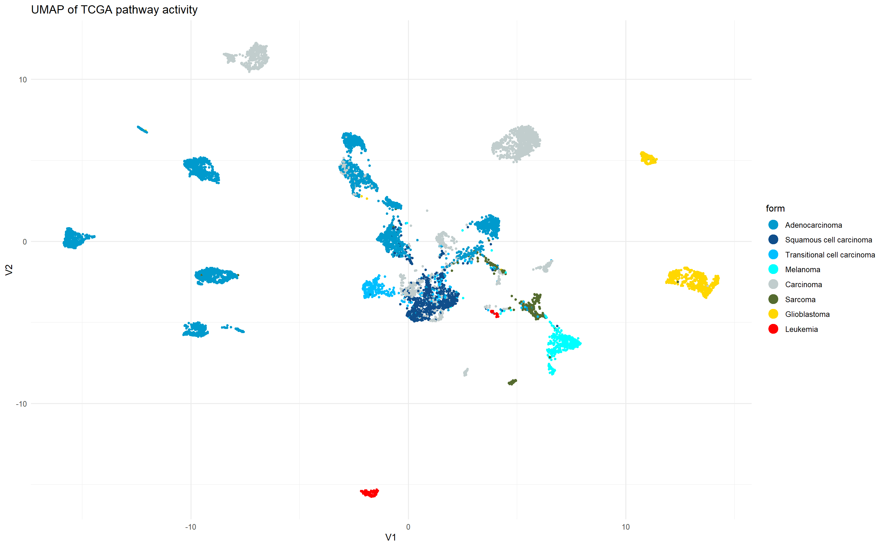
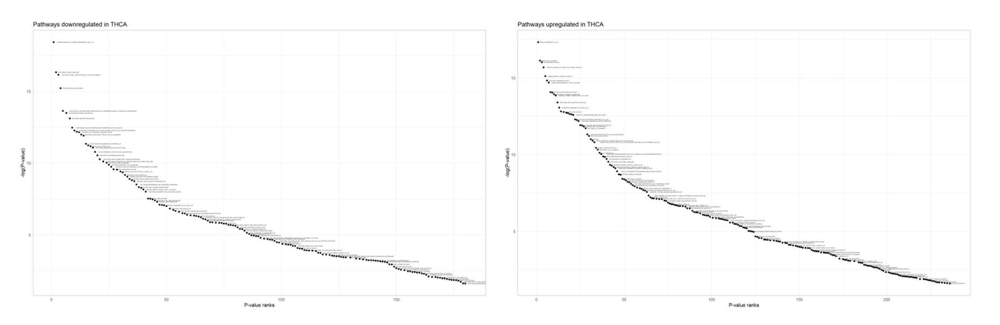

# Results

## Preprocessing

#### Deleting NA's

Deletion of NA's was applied to the three gene expression data frames (pan cancer and tumor and normal tissue data). Because the dimension of our data frames did not change during this process, it was assumed that there were no NA's in the data sets.

#### Low-variance filtering

The goal of the analysis was to identify the genes that show a significantly different expression in certain tumor types (Pan cancer analysis) or in comparison from normal and tumor tissue (THCA Analysis). Therefore genes with a similar expression in all patients are not relevant. Probably, these would be mostly housekeeping genes.

The histogram of the logarithmised variances of the pancancer data is displayed in \ref{xxx welche figure --> noch keine Überschrift}. The threshold of -1 was fixed and all genes with a lower variance were omitted. Doing so, the number of genes reduced from 60,000 to 19,000 genes.

The low-variance filtering of the THCA dataset was done in a similar way. The gene expression data of the cancer tissue was used to obtain the logarithmised variances of each gene. Genes with a lower variance than -1.25 were deleted in the tumor tissue and the normal tissue data. This resulted in a reduction from about 20,000 genes to 15,000 genes in both data frames.

#### Biotype filtering

The biotype of the genes from the selected metabolic pathways, the genes of the hallmark pathways and the genes of the gene expression matrix was determined, to keep those genes with the same biotype. Because the most genes are protein-coding, only protein-coding genes were maintained.

### Descriptive analysis

#### Mean-variance Plot

In the mean-variance plot, displayed in Figure \@ref(fig:showmeanvariance), genes with a very high variance and non-zero mean were annotated their ensemble ids.

```{r showmeanvariance, echo=FALSE, eval=TRUE, out.width='30%', fig.align='center', fig.cap="Mean-variance plot of cleaned TCGA expression data. Y-axis shows variance of a genes expression, x-axis shows mean of a genes expression"}

knitr::include_graphics("figures/Variance_over mean_cleaned_matrix.png")

```

#### Violin Plots

For descriptive analysis 5 violin plots were created for 5 different tumor types with the gene expression data from the TCGA Matrix, to compare the distribution of the data of 5 different tumor types. The violinplot can be seen in Figure \@ref(fig:showviolinplots). The white point in the middle of each plot shows the 50% quantile. For all tumor types it is located in the middle of the gene expression value 0 and 5. In this area is also the highest amount of genes for every tumor type. Going to the top or bottom the curve flattens because only a few genes are expression very high or very low. One can see, that the the distributions of all 5 tumor types are very similar. It can be concluded, that the other 28 tumor types of this data set are distributed in a similar way.

```{r showviolinplots, echo=FALSE, eval=TRUE, out.width='30%', fig.align='center', fig.cap="Mean-variance plot of cleaned TCGA expression data"}



```

#### Volcano plot

For the construction of the volcano plot the data for THCA from the data set for the focused analysis was used. The volcano plot is displayed in Figure \@ref(fig:showvolcanoplot). Not significantly differentially expressed genes were marked green, significantly over expressed genes are marked blue and significantly under expressed genes are marked red. The gene with a very low p-value differ the most from tumor to normal tissue and are annotated with their name.

```{r showvolcanoplot, echo=FALSE, eval=TRUE, out.width='30%', fig.align='center', fig.cap="Volcano plot of THCA expression data"}



```

#### GSEA

The results of the GSEA for THCA tissue can be seen in Figure \@ref(fig:GSEAHeat)

```{r GSEAHeat, echo=FALSE, eval=TRUE, out.width='90%', fig.align='center', fig.cap="GSEA performed on the THCA expression data, annotated with Pathway type, histoligical type and cluster."}


```

The patients are arranged horizontally, the pathways vertically. The heatmap shows the intensity of expression of each pathway in each patient. Red pathways are overexpressed, blue pathways are underexpressed. The axes were annotated with the pathways type (hallmark or metabolic), the histological type of the tumor and the cluster. Three main clusters form within the patients, that can be explained by similarities in pathway activity. It is possible, that the formation of clusters is caused by different pathways activity of each tumor type, because in cluster 3, only the classical type occurs, while tall cell thyroid cancer mainly occur in cluster 2 and folicular thyroid cancers mainly occur in cluster 1.

### !!! pan cancer für THCA - Jakob

Um die Clusterbildung zu bestätigen wurde die gleiche Analyse für die THCA daten aus dem großen gene expression dataframe durchgeführt. Auch in dieser Analyse formten sich 3 Cluster, die in zum Teil auf die hiytological types zurückzuführen sind. xxx

#### GSVA

To display the results of GSVA, obtained by analysis of metabolic and hallmark pathways and their expression in the gene expression data frame, a heat map, annotated with cancer type, histological type and pathway type was created. Even though, the individual pathways are not annotated, two observations were made, because it is possible to see similarities in pathway activity within groups of patients and tumor types. Firstly 3 clusters in THCA expression were detected to analyse them further in the next steps. Secondly, most tumor types were clustered clearly, while others did not see to form explicit clusters regarding the tumor type, but regarding the histological type. An observation, that is going to be analysed further.

```{r GSVAHeat, echo=FALSE, eval=TRUE, out.width='100%', fig.align='center', fig.cap="Results of GSVA, annotated with histological type, cancer type, pathway type and clusters"}


```

The observations, obtained from GSVA and the generated heatmap were checked with a heat map, displaying the mean expression of each pathway in each tumor type, annotated with histological type and pathway type. The tumor types were clustered based on their mean pathway activity. The results confirm the formation of clusters based on the histological type, therefore gene expression pattern is not dependent from each individual or their tumor type but by the histological type. Another observation is, that, the hallmark genes are mostly marked in a lighter colour.

```{r meanexp, echo=FALSE, eval=TRUE, out.width='50%', fig.align='center', fig.cap="Mean expression of each pathway in each tumot type, annotated with pathway type, histological cancer type and clusters."}

knitr::include_graphics("figures/Pan Cancer mean expression.png")
```

#### PCA

The PCA was performed with the basis of the calculated pathway activities and displayed in Figure \@ref(fig:PCAPanType), reduced to the first 2 PCs. Even though, clusters were formed in the analysis, they can not be clearly identified, in the figure. The samples were parked by tumor type and all patients of one tumor type occur in the same region, but they do not form individual clusters. The same plot was colored by histological type, showing, that patients with the same histological type occur close to each other. The results from the PCA confirm the results from the GSVA, pathways, that are included in th first two PCs, seem to cohere with the histological type.

```{r PCAPanType, echo=FALSE, eval=TRUE, out.width='75%', fig.align='center', fig.cap="PCA of TCGA expression data, colored by tumor type"}

knitr::include_graphics("figures/Pan Cancer PCA PC1und2.png")
```

```{r PCAPanForm, echo=FALSE, eval=TRUE, out.width='75%', fig.align='center', fig.cap="PCA of TCGA expression data, colored by form of tumor"}

knitr::include_graphics("figures/Pan Cancer PCA PC1und2 cancer form.png")
```

#### UMAP

Because the cluster structure displayed by the PCA was not as expected, the results from the PCA were used to create a UMAP. In Figure \@ref(fig:UMAPPanType) clear clusters can be seen, what reassures, that the tumor types have characteristic pathway activities. In the middle a big cluster can be seen, that can not be assigned to a certain tumor type. To detect the cause for this cluster, the UMAP was colored by histological types (Figure \@ref(fig:UMAPPanForm)), showing, that the big cluster in the middle mainly contains various carcinoma types like squamous cell carcinoma and transitional cell carcinoma. The UMAP confirmed again the assumption, that the histological type of a tumor has a mayor impact on the patients gene expression profile.

```{r UMAPPanType, echo=FALSE, eval=TRUE, out.width='50%', fig.align='center', fig.cap="UMAP of TCGA expression data, colored by tumor type"}


```

```{r UMAPPanForm, echo=FALSE, eval=TRUE, out.width='50%', fig.align='center', fig.cap="UMAP of TCGA expression data, colored by form of the tumor"}


```

The same analysis was performed for gene activity instead of pathway activity to check for reliability of the results. No differences could be detected,

#### Regression analysis

#### Focused analsis

#### PCA

PCA was also performed for focused analysis, um Untergruppen, die mit der Pathwayaktivität oder Genaktivität zusammenhängen, innerhalb der Thyroid tumors zu finden. Dafür wurden zuerst die Ergebnisse der GSEA verwendet. Der Versuch Cluster zu finden gestaltete sich hier leider schwerer, da weder durch Betrachtung des Thyroid Tumortyps, noch durch Betrachtung der Stage ein eindeutiger Zusammenhang erkannt werden konnte.

#### Figure X

A figure x was generated for THCA gene expression data obtained from the gene expression data frame. The obtained figure x can be seen in Figure \@ref(fig:figurex). Thereby pathways with the lowest p-value could be identified. The pathway for thyroxine biosynthesis is a downregulated pathway with a low p-value and is going to be predicted by linear regression analysis and the neuronal network.

```{r figurex, echo=FALSE, eval=TRUE, out.width='100%', fig.align='center', fig.cap="Figure X. -log10(p-values) plotted against ranked p-values, obtained from GSVA on THCA expression data from gene expression data frame. Left: downregulated pathways, right: upregulated pathways"}


```
