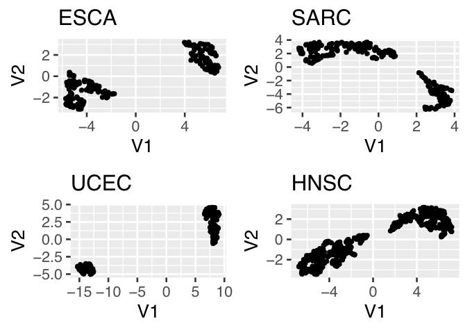

# Results
## Preprocessing

#### deleting NAs

Deletion of NAs was applied to the 2 gene expression data frames. Because the dimension of our data frames did not change during this process it was assumed, that there were no NAs in the data sets.

#### Low-variance filtering

The goal of the analysis was to itentify the genes that show a significantly different expression in certain tumor types (Pan cancer analysis) or in comparison from normal and tumor tissue (THCA Analysis). Therefore genes with a similar expression in all patients are not relevant.

The logarithm of the obtained values were displayed in a histogram shown in Figure xxx. The genes with a lower variance than -1 were omitted. The number of genes was reduced from 60,000 to 19,000 genes.

The low-variance filtering of the THCA dataset was done in a similar way. Genes with a lower variance than -1.25 were deleted. This resulted in a reduction from about 20,000 genes to 15,000 genes in the data frames for normal and tumor tissue.

#### Biotype filtering

The biotype of the genes from the selected metabolic pathways, the genes of the hallmark pathways and the genes of the gene expression matrix was determined, to keep those genes with the same bio type. Because the most genes are protein-coding, only protein-coding genes were maintained.

```{r showbiotypeshallmarks, echo=FALSE, eval=TRUE, out.width = '20%', fig.align = "center", fig.cap="**Biotypes of Hallamrk genes**"}

knitr::include_graphics("tcga_exp_biotypes.png")

```

```{r showbiotypesexp, echo=FALSE, eval=TRUE, out.width = '20%', fig.align = "center", fig.cap="**Biotypes of Gene expression Data frame**"}

knitr::include_graphics("tcga_exp_biotypes.png")

```

```{r showbiotypesmetabolic, echo=FALSE, eval=TRUE, out.width = '20%', fig.align = "center", fig.cap="**Biotypes of metabolic pathways**"}

knitr::include_graphics("tcga_exp_biotypes.png")

```

### Descriptive analysis

#### Mean-variance Plot

In the mean-variance plot, displayed in Figure \@ref(fig:showmeanvariance), genes with a very high variance and non-zero mean were annotated their ensemble ids.

```{r showmeanvariance, echo=FALSE, eval=TRUE, out.width='30%', fig.align='center', fig.cap="Mean-variance plot of cleaned TCGA expression data. Y-axis shows variance of a genes expression, x-axis shows mean of a genes expression"}

knitr::include_graphics("Variance_over mean_cleaned_matrix.png")

```

#### Violin Plots

For descriptive analysis 5 violin plots were created for 5 different tumor types with the gene expression data from the TCGA Matrix, to compare the distribution of the data of 5 different tumor types. The violinplot can be seen in Figure \@ref(fig:showviolinplots). The white point in the middle of each plot shows the 50% quantile. For all tumor types it is located in the middle of the gene expression value 0 and 5. In this area is also the highest amount of genes for every tumor type. Going to the top or bottom the curve flattens because only a few genes are expression very high or very low. One can see, that the the distributions of all 5 tumor types are very similar. It can be concluded, that the other 28 tumor types of this data set are distributed in a similar way.

```{r showviolinplots, echo=FALSE, eval=TRUE, out.width='30%', fig.align='center', fig.cap="Mean-variance plot of cleaned TCGA expression data"}

knitr::include_graphics("Vioplots cancer types.png")

```
#### Volcano plot

For the construction of the volcano plot the data for THCA from the data set for the focused analysis was used. The volcano plot is displayed in Figure \@ref(fig:showvolcanoplot). Not significantly differentially expressed genes were marked green, significantly over expressed genes are marked blue and significantly under expressed genes are marked red. The gene with a very low p-value differ the most from tumor to normal tissue and are annotated with their name.

```{r showvolcanoplot, echo=FALSE, eval=TRUE, out.width='30%', fig.align='center', fig.cap="Volcano plot of THCA expression data"}

knitr::include_graphics("Volcanoplot.png")

```

#### GSEA

The results of the GSEA for THCA tissue can be seen in Figure \@ref(fig:GSEAHeat)

```{r GSEAHeat, echo=FALSE, eval=TRUE, out.width='50%', fig.align='center', fig.cap="GSEA performed on the THCA expression data, annotated with Pathway type, histoligical type and cluster."}

knitr::include_graphics("THCA GSEA Heatmap fertig.png")
```

Horizontal sind die einzelnen Patienten angeordnet, vertikal die pathways, die Heatmap stellt die stärke der Expression der einzelnen pathways in den einzelnen Patienten dar. Rot markierte pathways sind überexprimiert, blaue sind unterexprimiert. Die Achsen wurden mit dem pathway typ, dem hiytological typ und dem cluster annotiert. Es bilden sich innnerhalb der Patienten 3 Cluster, die auf Gemiensamkeiten in der PAthwayaktivität zurückgeführt werden können. Vielleicht hängt die Clusterbildung mit dem histological type zusammen, da eindeutig erkennbar ist, dass in Cluster 3 nur der classical type vorhanden ist, während in Cluster 2 vermehrt Tall cell type auftritt und Folicular type vermehr in Cluster 1 auftritt.

### pan cancer für THCA

Um die Clusterbildung zu bestätigen wurde die gleiche Analyse für die THCA daten aus dem großen gene expression dataframe durchgeführt. Auch in dieser Analyse formten sich 3 Cluster, die in zum Teil auf die hiytological types zurückzuführen sind. xxx

#### GSVA

xxx Was wir aus der Heatmap sehen???

```{r GSVAHeat, echo=FALSE, eval=TRUE, out.width='30%', fig.align='center', fig.cap="PCA of TCGA expression data, colored by tumor type"}

knitr::include_graphics("GSVA Heatmap fertig.png")
```

#### PCA

Die PCA wurde anhand der Pathway Aktivitäten durchgeführt und reduziert auf die ersten 2 PCs in Figure \@ref(fig:PCAPanType) dargestellt. Es sind ansatzweise cluster, aber keine eindeutigen Strukturen zu erkennen. Die zusammensetzung der PCs und die Erklärung der AVrianz durch die einzelnen VAriablen kann Figure \@ref(fig:) entnommen werden. BESCHREIBUNG DER PCA UND DER VARIANZVERTEILUNG. Der Plot wurde auch nach Form des Tumors angefärbt und in Figure \@ref(fig:PCAPanForm) dargestellt. Hier ist eine klarere Struktur zu erkennen als bei Anfärbung nach Tumortyp. Daraus lässt sich schließen, dass zumindest die PC1 und PC2 inkludierten Pathways mit der Form des Tumors zusammenhängen.

Um die Ergebnisse zu überprüfen wurde die PCA auch auf die Genaktivität angewendet, es war kein Unterschied zu erkennen.

```{r PCAPanType, echo=FALSE, eval=TRUE, out.width='30%', fig.align='center', fig.cap="PCA of TCGA expression data, colored by tumor type"}

knitr::include_graphics("Pan Cancer PCA PC1und2.png")
```

```{r PCAPanForm, echo=FALSE, eval=TRUE, out.width='30%', fig.align='center', fig.cap="PCA of TCGA expression data, colored by form of tumor"}

knitr::include_graphics("Pan Cancer PCA PC1und2 cancer form.png")
```

#### UMAP

DA durch die PCA keine eindeutigen Cluster erkennbar wurden, wurden die Ergebnisse der PCA genutzt, um eine UMAP zu erstellen. Die Ergebnisse sind in Figure \@ref(fig:UMAPPanType) zu sehen. Hier sind eindeutige Cluser zu erkennen, auch wenn die Abstände zwischen den Clustern nicht proportional zu den wahren Unterschieden sind, kann daraus geschlossen werden, dass die einzelnen Tumortypen charakteristische Pathwayaktivitäten haben, wie zum Beispiel KIRC. Viele Tumortypen haben aber auch ähnliche Pathwayaktivitäten wie zum Beispiel GBM und SARC.

Um die Ursache dafür zu finden wurde auch hier die UMAP nach Form des Tumors markiert/gefärbt. Die Ergebnisse sind in Figure \@ref(fig:UMAPPanForm) zu sehen. Es ist eindeutig zu erkennen, dass die Pathwayaktivität auch mit der Form des Tumors zusammenhängt. Zum Beispiel sind Glioblastome eindeutig von Adenocarcinomen getrennt. Allerdings ist auch hier das große Cluster in der Mitte nicht eindeutig einer Tumorform zuzuordnen.

```{r UMAPPanType, echo=FALSE, eval=TRUE, out.width='50%', fig.align='center', fig.cap="UMAP of TCGA expression data, colored by tumor type"}

knitr::include_graphics("figures/Pan Cancer UMAP.png")
```

```{r UMAPPanForm, echo=FALSE, eval=TRUE, out.width='50%', fig.align='center', fig.cap="UMAP of TCGA expression data, colored by form of the tumor"}

knitr::include_graphics("figures/Pan Cancer UMAP cancer form.png")
```

#### Regression analysis

### Focused analsis

#### PCA

PCA was also performed for focused analysis, um Untergruppen, die mit der Pathwayaktivität oder Genaktivität zusammenhängen, innerhalb der Thyroid tumors zu finden. Dafür wurden zuerst die Ergebnisse der GSEA verwendet. Der Versuch Cluster zu finden gestaltete sich hier leider schwerer, da weder durch Betrachtung des Thyroid Tumortyps, noch durch Betrachtung der Stage ein eindeutiger Zusammenhang erkannt werden konnte.


## 33 tumor types are showing disting clusters in UMAP

hello world!

## blb alsdjflaskdf umap of some tumortypes

Figure generation. You can do it with knitr or with latex formatting. This is knitr:

```{r figure1, fig.cap="Title. Description",echo=FALSE}

```


easier alternative: this is latex formatting. In Figure \ref{figure1} you can see an UMAP. (+ label your figures, equations etc and then reference with /\ref{})

\begin{figure}[htbp]
    \centering
    \includegraphics{figures/figure1.png}
    \caption[\textbf{Title}.]{\textbf{Title}. Description.}
    \label{figure1}
\end{figure}

