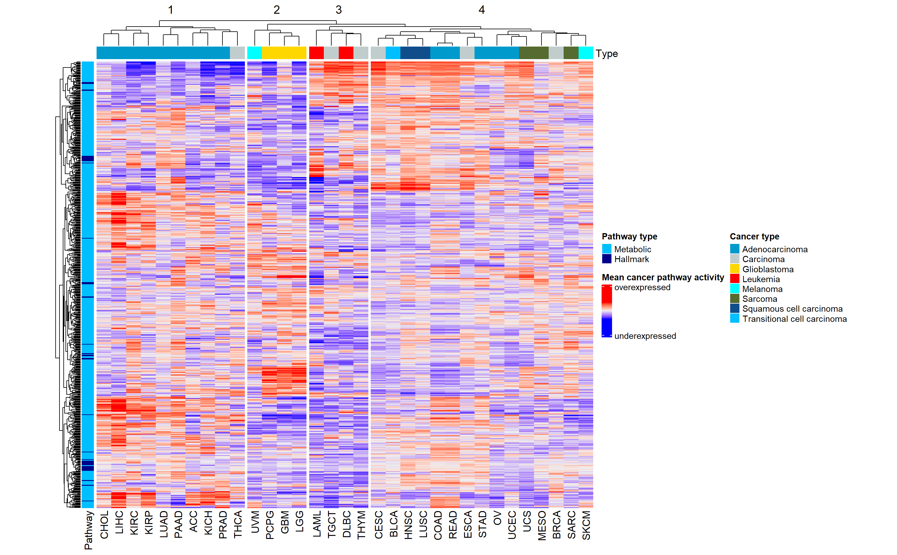

# Results

## Preprocessing

#### Deleting NA's

Deletion of NA's was applied to the three gene expression data frames (pan cancer and tumor and normal tissue data). Because the dimension of our data frames did not change during this process, it was assumed that there were no NA's in the data sets.

#### Low-variance filtering

The goal of the analysis was to identify the genes that show a significantly different expression in certain tumor types (Pan cancer analysis) or in comparison from normal and tumor tissue (THCA Analysis). Therefore genes with a similar expression in all patients are not relevant. Probably, these would be mostly housekeeping genes.

The histogram of the logarithmised variances of the pancancer data is displayed in \ref{xxx welche figure --> noch keine Überschrift}. The threshold of -1 was fixed and all genes with a lower variance were omitted. Doing so, the number of genes reduced from 60,000 to 19,000 genes.

The low-variance filtering of the THCA dataset was done in a similar way. The gene expression data of the cancer tissue was used to obtain the logarithmised variances of each gene. Genes with a lower variance than -1.25 were deleted in the tumor tissue and the normal tissue data. This resulted in a reduction from about 20,000 genes to 15,000 genes in both data frames.

#### Biotype filtering

The biotype of the genes from the selected metabolic pathways, the genes of the hallmark pathways and the genes of the gene expression matrix was determined, to keep those genes with the same biotype. Because the most genes are protein-coding, only protein-coding genes were maintained.

### Descriptive analysis

#### Mean-variance Plot

In the mean-variance plot, displayed in Figure \@ref(fig:showmeanvariance), genes with a very high variance and non-zero mean were annotated their ensemble ids.

```{r showmeanvariance, echo=FALSE, eval=TRUE, out.width='30%', fig.align='center', fig.cap="Mean-variance plot of cleaned TCGA expression data. Y-axis shows variance of a genes expression, x-axis shows mean of a genes expression"}

knitr::include_graphics("figures/Variance_over mean_cleaned_matrix.png")

```

#### Violin Plots

For descriptive analysis 5 violin plots were created for 5 different tumor types with the gene expression data from the TCGA Matrix, to compare the distribution of the data of 5 different tumor types. It can be concluded, that the other 28 tumor types of this data set are distributed in a similar way. Violinplots can be seen in the appendix.

#### Volcano plot

For the construction of the volcano plot the data for THCA from the data set for the focused analysis was used. The volcano plot is displayed in Figure \@ref(fig:showvolcanoplot). Not significantly differentially expressed genes were marked green, significantly over expressed genes are marked blue and significantly under expressed genes are marked red. The gene with a very low p-value differ the most from tumor to normal tissue and are annotated with their name.

```{r showvolcanoplot, echo=FALSE, eval=TRUE, out.width='30%', fig.align='center', fig.cap="Volcano plot of THCA expression data"}

knitr::include_graphics("figures/Volcanoplot.png")

```

#### GSEA

The results of the GSEA for THCA tissue can be seen in Figure \@ref(fig:GSEAHeat)

```{r GSEAHeat, echo=FALSE, eval=TRUE, out.width='90%', fig.align='center', fig.cap="GSEA performed on the THCA expression data, annotated with Pathway type, histoligical type and cluster."}

knitr::include_graphics("figures/THCA GSEA Heatmap fertig.png")
```

The patients are arranged horizontally, the pathways vertically. The heatmap shows the intensity of expression of each pathway in each patient. Red pathways are overexpressed, blue pathways are underexpressed. The axes were annotated with the pathways type (hallmark or metabolic), the histological type of the tumor and the cluster. Three main clusters form within the patients, that can be explained by similarities in pathway activity. It is possible, that the formation of clusters is caused by different pathways activity of each tumor type, because in cluster 3, only the classical type occurs, while tall cell thyroid cancer mainly occur in cluster 2 and folicular thyroid cancers mainly occur in cluster 1.

### !!! pan cancer für THCA - Jakob

Um die Clusterbildung zu bestätigen wurde die gleiche Analyse für die THCA daten aus dem großen gene expression dataframe durchgeführt. Auch in dieser Analyse formten sich 3 Cluster, die in zum Teil auf die hiytological types zurückzuführen sind. xxx

#### GSVA

To display the results of GSVA, obtained by analysis of metabolic and hallmark pathways and their expression in the gene expression data frame, a heat map, annotated with cancer type, histological type and pathway type was created.

```{r GSVAHeat, echo=FALSE, eval=TRUE, out.width='100%', fig.align='center', fig.cap="Results of GSVA, annotated with histological type, cancer type, pathway type and clusters"}

knitr::include_graphics("figures/GSVA Heatmap fertig.png")
```

To see general clusters a heatmap with the mean expression of each gene in each tumor type was generated and clustered hierarchically. Figure \@ref(fig:) only shows the 100 most variant pathways. A heatmap with all of the pathways can be seen in the appendix.

The tumor types were clustered based on their mean pathway activity and formed 4 clusters, that can be linked to the histological type. The first cluster contains mostly adenocarcinamas, while the second one contains mostly Glioblastomas. Leukemia is only found in the third cluster and the last cluster contains sarcomas and carcinomas. Melanomas occur in the second an fourth cluster.

Furthermore, four observations were made regarding specific information about pathway activity. On the bottom of Figure \@ref(fig:) 2 big clusters can be seen. One of them is mostly downregulated and mostly Adenocarcinomas, Glioblastomas and carcinomas in general. The upregulated cluster contains various hiytological and tumor types, which is why no tendencies in those types could be seen.

These two clusters contain mostly pathways that are important for nucleus import and export like Nasopharygeal carcinoma (NPC) and Ran pathways. Furthermore they contain a pathway for transcription regulaturs in embryonic stem cells. Both mechanisms, transcription regulators and nucleus transport, regulate gene expression. A possible explanation for those two clusters was shown by Ittai Ben-Porath .... xxx. The Expression of transcription regulators depend on the stage of differentiation. [An embryonic stem cell-like gene expression signature in poorly differentiated aggressive human tumors - PubMed (nih.gov)](https://pubmed.ncbi.nlm.nih.gov/18443585/) xxx

Another observation is the clustering of glioblastoma due to highly upregulated pathways. The highest regulated pathway initiates neurogenesis <https://www.ncbi.nlm.nih.gov/pmc/articles/PMC8330525/> xxx. Another upregulated pathways are linked to differentiation of the neural crest. The neural crest forms stem cells which are used for development of glia and nervous cells. It can be assumed, that the upregulation of differentiation of stem cells is used to form more tumor cells in the brain and thereby promote proliferation.Two other pathways, that are upregulated in glioblastoma cells are pathways linked to the activity of tyrosine kinases. The upregulation of tyrosine kinases promote cell growth and proliferation. (Quelle: the cell) xxx

To summarize the findings regarding upregulated pathways in glioblastomas, one can say, that most pathways concern the cell growth and differentiation of the affected tumor cells in the brain. Regarding, that a glioblastoma is a highly aggressive cancer, the extreme upregulation can be explained.

The third cluster, that could be identified mainly related to adenocarcinomas, more specific Liver hepatocellular carcinoma (LIHC), Kidney renal papillary cell carcinoma (KICH) and Kidney renal clear cell carcinoma (KIRC). The upregulated pathways are involved in metabolism of carbohydrates, synthesis of lipids, synthesis of amino acids and detoxification. An upregulation of all of these pathways may lead to cell growth and proliferation, due to higher metabolic activity, providing more biomass and energy.

```{r meanexp, echo=FALSE, eval=TRUE, out.width='50%', fig.align='center', fig.cap="Mean expression of each pathway in each tumot type, annotated with pathway type, histological cancer type and clusters."}


```

#### PCA

The PCA was performed with the basis of the calculated pathway activities and displayed in Figure \@ref(fig:PCAPanType), reduced to the first 2 PCs. Even though, clusters were formed in the analysis, they can not be clearly identified, in the figure. The samples were parked by tumor type and all patients of one tumor type occur in the same region, but they do not form individual clusters. The same plot was colored by histological type, showing, that patients with the same histological type occur close to each other. The results from the PCA confirm the results from the GSVA, pathways, that are included in th first two PCs, seem to cohere with the histological type.

```{r PCAPanType, echo=FALSE, eval=TRUE, out.width='75%', fig.align='center', fig.cap="PCA of TCGA expression data, colored by tumor type"}

knitr::include_graphics("figures/Pan Cancer PCA PC1und2.png")
```

```{r PCAPanForm, echo=FALSE, eval=TRUE, out.width='75%', fig.align='center', fig.cap="PCA of TCGA expression data, colored by form of tumor"}

knitr::include_graphics("figures/Pan Cancer PCA PC1und2 cancer form.png")
```

#### UMAP

Because the cluster structure displayed by the PCA was not as expected, the results from the PCA were used to create a UMAP. In Figure \@ref(fig:UMAPPanType) clear clusters can be seen, what reassures, that the tumor types have characteristic pathway activities. In the middle a big cluster can be seen, that can not be assigned to a certain tumor type. To detect the cause for this cluster, the UMAP was colored by histological types (Figure \@ref(fig:UMAPPanForm)), showing, that the big cluster in the middle mainly contains various carcinoma types like squamous cell carcinoma and transitional cell carcinoma. The UMAP confirmed again the assumption, that the histological type of a tumor has a mayor impact on the patients gene expression profile.

```{r UMAPPanType, echo=FALSE, eval=TRUE, out.width='50%', fig.align='center', fig.cap="UMAP of TCGA expression data, colored by tumor type"}

knitr::include_graphics("figures/Pan Cancer UMAP.png")
```

```{r UMAPPanForm, echo=FALSE, eval=TRUE, out.width='50%', fig.align='center', fig.cap="UMAP of TCGA expression data, colored by form of the tumor"}

knitr::include_graphics("figures/Pan Cancer UMAP cancer form.png")
```

The same analysis was performed for gene activity instead of pathway activity to check for reliability of the results. No differences could be detected,

#### Regression analysis

#### Focused analsis
####GSVA on THCA expression data reveals pathways driving thyroid carcinogenesis.
To grasp a general overview of the differences in pathway activity between THCA and homeostatic thyroid tissue, GSVA was performed for the THCA expression data. Then, changes in pathway activity were computed by log2 fold change and the respective p-values were computed by a Wilcoxon rank-sum test. The most significantly altered pathways were then characterized.
Most prominently among them were pathways linked to proliferative signaling such as upregulation of p53 inhibitory proteins and hedgehog pathway activating Gli proteins.
Further, the alpha6beta4 integrin signaling pathway and associated pathways such as IL-36 signaling and Typ I hemidesmosome synthesis were significantly enhanced in THCA. These findings are consistent with previous studies that linked alpha6beta4 signaling to the development of aggressive forms of thyroid cancer. Quelle: Effect of beta 4 Integrin Knockdown by RNA Interference in Anaplastic Thyroid Carcinoma, Queen D, Ediriweera C and Liu L (2019) Function and Regulation of IL-36 Signaling in Inflammatory Diseases and Cancer Development. Front. Cell Dev. Biol. 7:317. doi: 10.3389/fcell.2019.00317, Msigdb
 Also, oncogenic signaling pathways commonly associated with different cancer types were significantly upregulated in THCAs. Among them, we observed ERBB2 QUELLE MSigDB and MST1 signaling commonly found in breast cancer. A role for MSP/Ron in breast cancer has recently been elucidated, wherein this pathway regulates tumor growth, angiogenesis, and metastasis.  Kretschmann KL, Eyob H, Buys SS, Welm AL. The macrophage stimulating protein/Ron pathway as a potential therapeutic target to impede multiple mechanisms involved in breast cancer progression. Curr Drug Targets. 2010 Sep;11(9):1157-68. doi: 10.2174/138945010792006825. PMID: 20545605.
Further, signaling through the EWSR1/FL1-fusion protein was significantly upregulated in THCA and previously shown to promote the rapid development of myeloid/erythroid leukemia in mice Quelle Msigdb. Lastly, THCAs showed downregulation of non-histone protein methylation. This process was identified as an import modulator of intracellular signaling by the MAPK, WNT, BMP, Hippo, and JAK/STAT pathways and might play an important role as a driver of carcinogenesis in THCA.
Biggar, K., Li, SC. Non-histone protein methylation as a regulator of cellular signalling and function. Nat Rev Mol Cell Biol 16, 5–17 (2015). https://doi.org/10.1038/nrm3915
Together these findings give a general overview of mechanisms driving carcinogenesis in THCA. However, no information about possible THCA subtypes or differences in patway activity between patients can be obtained from this data.

####Pan-cancer data GSVA reveals three subtypes of THCA altering in proliferative signaling.
To investigate potential subtypes of THCA, the respective samples were taken from the pan-cancer GSVA data. The optimal number of clusters was determined by an elbow plot and subsequent K-means clustering revealed a total of three subtypes in THCA. This is consistent with the three clusters of THCA observed in the full pan-cancer GSVA data.
The follicular histological type was enriched in cluster B, with no tall cell types present in this cluster. Judging from histological type alone no difference in clusters A and C was observed. Most significant changes in pathway activity were observed in pathways concerning proliferative signaling. In comparison with all other tumor types, cluster A displayed high activity of RAS, JAK/STAT and EWSR1/FL1-fusion mediated signaling as well as elevated signatures associated with carcinogenesis driven by alpha6beta4 activity. In contrast, these pathways were downregulated in cluster B, with it showing elevated activity in mTOR, MAPK, PI3K, and EGFR signaling cascades. Cluster C was found to upregulate all the aforementioned forms of proliferative signaling. All clusters showed a homogenous upregulation of hedgehog, ERBB2, and MST1 pathway activity. Regarding immune response, cluster C showed no significant alterations in the respective hallmark pathways, however, these pathways were downregulated in both clusters A and B.
With this data, we can identify two seemingly different forms of proliferative signaling driving carcinogenesis in THCA. These forms can either occur separately as in the case of clusters A and B or combined as for cluster C.

####THCA subtypes do not differ in their metabolism.
To investigate how the identified subtypes compare to homeostatic thyroid tissue, GSEA was performed for the THCA data. Consistent with the pan-cancer analysis of THCA data, k-means clustering obtained three different clusters in pathway activity – verified as the optimal number of clusters via an elbow plot.
All clusters showed a similar change in metabolism. Katabolic pathways are downregulated whereas anabolic pathways e.g., fatty acid synthesis show increased activity in comparison with normal tissue. These changes in metabolic activity are in line with the Warburg effect. Further, the results seem consistent with the proliferative signaling activities found previously. Alpha6beta4, RAS, JAK/STAT, and EWSR1/FL1-fusion mediated signaling is upregulated in clusters one and three with low expression in cluster two. However, the expected upregulation of mTOR, MAPK, PI3K, and EGFR signaling in clusters two and three was observed only in some samples. Regarding, immune response the expression profiles are again consistent with differences observed in the GSVA pan-cancer data: Both clusters one and two show a lower immune response compared to cluster three. 
From these GSEA results, we can conclude that the three subtypes of THCA differ in carcinogenesis and associated immune response but share a similar metabolism consistent with the Warburg effect.


#### PCA

PCA was also performed for focused analysis, um Untergruppen, die mit der Pathwayaktivität oder Genaktivität zusammenhängen, innerhalb der Thyroid tumors zu finden. Dafür wurden zuerst die Ergebnisse der GSEA verwendet. Der Versuch Cluster zu finden gestaltete sich hier leider schwerer, da weder durch Betrachtung des Thyroid Tumortyps, noch durch Betrachtung der Stage ein eindeutiger Zusammenhang erkannt werden konnte.

#### Figure X

A figure x was generated for THCA gene expression data obtained from the gene expression data frame. The obtained figure x can be seen in Figure \@ref(fig:figurex). Thereby pathways with the lowest p-value could be identified. The pathway for thyroxine biosynthesis is a downregulated pathway with a low p-value and is going to be predicted by linear regression analysis and the neuronal network.

```{r figurex, echo=FALSE, eval=TRUE, out.width='100%', fig.align='center', fig.cap="Figure X. -log10(p-values) plotted against ranked p-values, obtained from GSVA on THCA expression data from gene expression data frame. Left: downregulated pathways, right: upregulated pathways"}

knitr::include_graphics("figures/2figurexTHCA.png")
```
